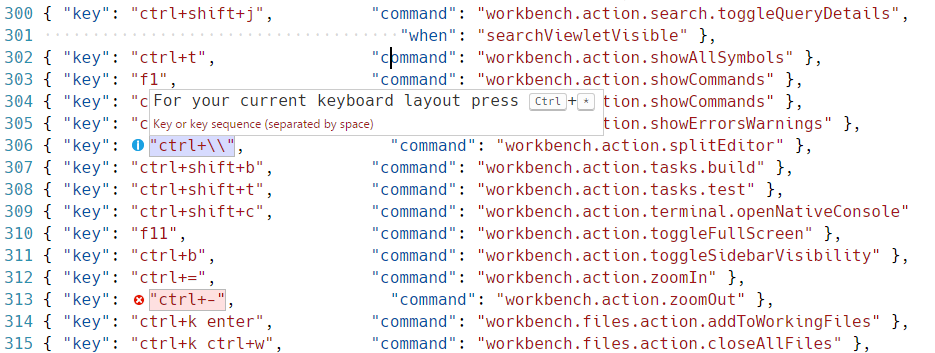
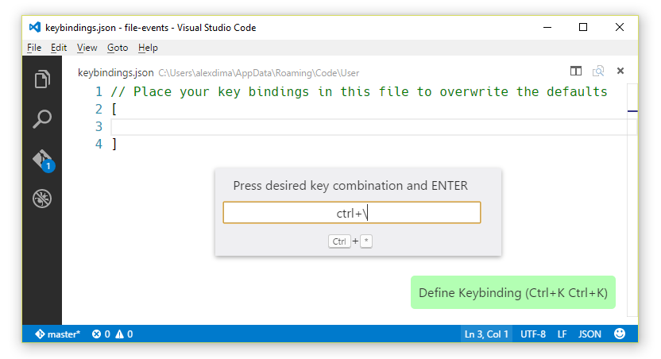
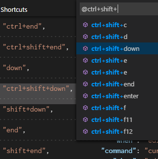

# VS Code 的快捷按键(Key Bindings for Visual Studio Code)

Visual Studio Code lets you perform most tasks directly from the keyboard.  This page lists out the default bindings and describes how you can update them.

Visual Studio Code允许您直接从键盘执行大多数任务。此页面列出了默认绑定，并介绍了如何更新它们。

>**Note:** If you visit this page on a Mac, you will see the key bindings for the Mac.  If you visit using Windows or Linux, you will see the keys for that OS. If you need the key binding for another OS, hover your mouse over the key you are interested in.

>**注意：** 如果您在Mac上访问此页面，您将看到Mac的键绑定。如果使用Windows或Linux访问，您将看到该操作系统的密钥。如果您需要另一个操作系统的键绑定，将鼠标悬停在您感兴趣的键上。

>**Note:** The following keys are rendered assuming a standard US keyboard layout. If you use a different keyboard layout, please [read below](快捷键绑定.md#keyboard-layouts).

>**注意：** 以下键是使用标准美式键盘布局呈现的。如果您使用不同的键盘布局，请阅读[这一部分](快捷键绑定.md#keyboard-layouts)。

## 基本编辑(Basic Editing)

Command | Key | Command id
--- | --- | ---
Cut line (empty selection) | `Ctrl+X` | `editor.action.clipboardCutAction`
Copy line (empty selection) | `Ctrl+C` | `editor.action.clipboardCopyAction`
Paste | `Ctrl+V` | `editor.action.clipboardPasteAction`
Delete Line | `Ctrl+Shift+K` | `editor.action.deleteLines`
Insert Line Below | `Ctrl+Enter` | `editor.action.insertLineAfter`
Insert Line Above | `Ctrl+Shift+Enter` | `editor.action.insertLineBefore`
Move Line Down | `Alt+Down` | `editor.action.moveLinesDownAction`
Move Line Up | `Alt+Up` | `editor.action.moveLinesUpAction`
Copy Line Down | `Shift+Alt+Down` | `editor.action.copyLinesDownAction`
Copy Line Up | `Shift+Alt+Up` | `editor.action.copyLinesUpAction`
Undo | `Ctrl+Z` | `undo`
Redo | `Ctrl+Y` | `redo`
Add Selection To Next Find Match | `Ctrl+D` | `editor.action.addSelectionToNextFindMatch`
Move Last Selection To Next Find Match | `Ctrl+K Ctrl+D` | `editor.action.moveSelectionToNextFindMatch`
Undo last cursor operation | `Ctrl+U` | `cursorUndo`
Insert cursor at end of each line selected | `Shift+Alt+I` | `editor.action.insertCursorAtEndOfEachLineSelected`
Select all occurrences of current selection | `Ctrl+Shift+L` | `editor.action.selectHighlights`
Select all occurrences of current word | `Ctrl+F2` | `editor.action.changeAll`
Select current line | `Ctrl+L` | `expandLineSelection`
Insert Cursor Below | `Ctrl+Alt+Down` | `editor.action.insertCursorBelow`
Insert Cursor Above | `Ctrl+Alt+Up` | `editor.action.insertCursorAbove`
Jump to matching bracket | `Ctrl+Shift+\` | `editor.action.jumpToBracket`
Indent Line | `Ctrl+]` | `editor.action.indentLines`
Outdent Line | `Ctrl+[` | `editor.action.outdentLines`
Go to Beginning of Line | `Home` | `cursorHome`
Go to End of Line | `End` | `cursorEnd`
Go to End of File | `Ctrl+End` | `cursorBottom`
Go to Beginning of File | `Ctrl+Home` | `cursorTop`
Scroll Line Down | `Ctrl+Down` | `scrollLineDown`
Scroll Line Up | `Ctrl+Up` | `scrollLineUp`
Scroll Page Down | `Alt+PageDown` | `scrollPageDown`
Scroll Page Up | `Alt+PageUp` | `scrollPageUp`
Fold (collapse) region | `Ctrl+Shift+[` | `editor.fold`
Unfold (uncollapse) region | `Ctrl+Shift+]` | `editor.unfold`
Fold (collapse) all subregions | `Ctrl+K Ctrl+[` | `editor.foldRecursively`
Unfold (uncollapse) all subregions | `Ctrl+K Ctrl+]` | `editor.unfoldRecursively`
Fold (collapse) all regions | `Ctrl+K Ctrl+0` | `editor.foldAll`
Unfold (uncollapse) all regions | `Ctrl+K Ctrl+J` | `editor.unfoldAll`
Add Line Comment | `Ctrl+K Ctrl+C` | `editor.action.addCommentLine`
Remove Line Comment | `Ctrl+K Ctrl+U` | `editor.action.removeCommentLine`
Toggle Line Comment | `Ctrl+/` | `editor.action.commentLine`
Toggle Block Comment | `Shift+Alt+A` | `editor.action.blockComment`
Find | `Ctrl+F` | `actions.find`
Replace | `Ctrl+H` | `editor.action.startFindReplaceAction`
Find Next | `Enter` | `editor.action.nextMatchFindAction`
Find Previous | `Shift+Enter` | `editor.action.previousMatchFindAction`
Select All Occurrences of Find Match | `Alt+Enter` | `editor.action.selectAllMatches`
Toggle Find Case Sensitive | `Alt+C` | `toggleFindCaseSensitive`
Toggle Find Regex | `Alt+R` | `toggleFindRegex`
Toggle Find Whole Word | `Alt+W` | `toggleFindWholeWord`
Toggle Use of Tab Key for Setting Focus | `Ctrl+M` | `editor.action.toggleTabFocusMode`
Toggle Render Whitespace | `unassigned` | `toggleRenderWhitespace`
Toggle Word Wrap | `Alt+Z` | `editor.action.toggleWordWrap`


## 更加丰富的语言编辑(Rich Languages Editing)

Command | Key | Command id
--- | --- | ---
Trigger Suggest | `Ctrl+Space` | `editor.action.triggerSuggest`
Trigger Parameter Hints | `Ctrl+Shift+Space` | `editor.action.triggerParameterHints`
Format Document | `Shift+Alt+F` | `editor.action.formatDocument`
Format Selection | `Ctrl+K Ctrl+F` | `editor.action.formatSelection`
Go to Definition | `F12` | `editor.action.revealDefinition`
Show Hover | `Ctrl+K Ctrl+I` | `editor.action.showHover`
Peek Definition | `Alt+F12` | `editor.action.peekDefinition`
Open Definition to the Side | `Ctrl+K F12` | `editor.action.revealDefinitionAside`
Quick Fix | `Ctrl+.` | `editor.action.quickFix`
Go to References | `Shift+F12` | `editor.action.goToReferences`
Rename Symbol | `F2` | `editor.action.rename`
Replace with Next Value | `Ctrl+Shift+.` | `editor.action.inPlaceReplace.down`
Replace with Previous Value | `Ctrl+Shift+,` | `editor.action.inPlaceReplace.up`
Expand AST Selection | `Shift+Alt+Right` | `editor.action.smartSelect.expand`
Shrink AST Selection | `Shift+Alt+Left` | `editor.action.smartSelect.shrink`
Trim Trailing Whitespace | `Ctrl+K Ctrl+X` | `editor.action.trimTrailingWhitespace`
Change Language Mode | `Ctrl+K M` | `workbench.action.editor.changeLanguageMode`


## 导航(Navigation)

Command | Key | Command id
--- | --- | ---
Show All Symbols | `Ctrl+T` | `workbench.action.showAllSymbols`
Go to Line... | `Ctrl+G` | `workbench.action.gotoLine`
Go to File..., Quick Open | `Ctrl+P` | `workbench.action.quickOpen`
Go to Symbol... | `Ctrl+Shift+O` | `workbench.action.gotoSymbol`
Show Problems | `Ctrl+Shift+M` | `workbench.actions.view.problems`
Go to Next Error or Warning | `F8` | `editor.action.marker.nextInFiles`
Go to Previous Error or Warning | `Shift+F8` | `editor.action.marker.prevInFiles`
Show All Commands | `Ctrl+Shift+P or F1` | `workbench.action.showCommands`
Navigate Editor Group History | `Ctrl+Tab` | `workbench.action.quickOpenPreviousRecentlyUsedEditorInGroup`
Go Back | `Alt+Left` | `workbench.action.navigateBack`
Go back in Quick Input | `Alt+Left` | `workbench.action.quickInputBack`
Go Forward | `Alt+Right` | `workbench.action.navigateForward`
Focus Breadcrumbs | `Ctrl+Shift+;` | `breadcrumbs.focus`
Focus and Select Breadcrumbs | `Ctrl+Shift+.` | `breadcrumbs.focusAndSelect`


## 编辑器/窗口管理(Editor/Window Management)

Command | Key | Command id
--- | --- | ---
New Window | `Ctrl+Shift+N` | `workbench.action.newWindow`
Close Window | `Alt+F4` | `workbench.action.closeWindow`
Close Editor | `Ctrl+W` | `workbench.action.closeActiveEditor`
Close Folder | `Ctrl+K F` | `workbench.action.closeFolder`
Cycle Between Editor Groups | `unassigned` | `workbench.action.navigateEditorGroups`
Split Editor | `Ctrl+\` | `workbench.action.splitEditor`
Focus into First Editor Group | `Ctrl+1` | `workbench.action.focusFirstEditorGroup`
Focus into Second Editor Group | `Ctrl+2` | `workbench.action.focusSecondEditorGroup`
Focus into Third Editor Group | `Ctrl+3` | `workbench.action.focusThirdEditorGroup`
Focus into Editor Group on the Left | `unassigned` | `workbench.action.focusPreviousGroup`
Focus into Editor Group on the Right | `unassigned` | `workbench.action.focusNextGroup`
Move Editor Left | `Ctrl+Shift+PageUp` | `workbench.action.moveEditorLeftInGroup`
Move Editor Right | `Ctrl+Shift+PageDown` | `workbench.action.moveEditorRightInGroup`
Move Active Editor Group Left | `Ctrl+K Left` | `workbench.action.moveActiveEditorGroupLeft`
Move Active Editor Group Right | `Ctrl+K Right` | `workbench.action.moveActiveEditorGroupRight`
Move Editor into Next Group | `Ctrl+Alt+Right` | `workbench.action.moveEditorToNextGroup`
Move Editor into Previous Group | `Ctrl+Alt+Left` | `workbench.action.moveEditorToPreviousGroup`


## 文件管理(File Management)

Command | Key | Command id
--- | --- | ---
New File | `Ctrl+N` | `workbench.action.files.newUntitledFile`
Open File... | `Ctrl+O` | `workbench.action.files.openFile`
Save | `Ctrl+S` | `workbench.action.files.save`
Save All | `Ctrl+K S` | `saveAll`
Save As... | `Ctrl+Shift+S` | `workbench.action.files.saveAs`
Close | `Ctrl+W` | `workbench.action.closeActiveEditor`
Close Others | `unassigned` | `workbench.action.closeOtherEditors`
Close Group | `Ctrl+K W` | `workbench.action.closeEditorsInGroup`
Close Other Groups | `unassigned` | `workbench.action.closeEditorsInOtherGroups`
Close Group to Left | `unassigned` | `workbench.action.closeEditorsToTheLeft`
Close Group to Right | `unassigned` | `workbench.action.closeEditorsToTheRight`
Close All | `Ctrl+K Ctrl+W` | `workbench.action.closeAllEditors`
Reopen Closed Editor | `Ctrl+Shift+T` | `workbench.action.reopenClosedEditor`
Keep Open | `Ctrl+K Enter` | `workbench.action.keepEditor`
Copy Path of Active File | `Ctrl+K P` | `workbench.action.files.copyPathOfActiveFile`
Reveal Active File in Windows | `Ctrl+K R` | `workbench.action.files.revealActiveFileInWindows`
Show Opened File in New Window | `Ctrl+K O` | `workbench.action.files.showOpenedFileInNewWindow`
Compare Opened File With | `unassigned` | `workbench.files.action.compareFileWith`


## Display

Command | Key | Command id
--- | --- | ---
Toggle Full Screen | `F11` | `workbench.action.toggleFullScreen`
Toggle Zen Mode | `Ctrl+K Z` | `workbench.action.toggleZenMode`
Leave Zen Mode | `Escape Escape` | `workbench.action.exitZenMode`
Zoom in | `Ctrl+=` | `workbench.action.zoomIn`
Zoom out | `Ctrl+-` | `workbench.action.zoomOut`
Reset Zoom | `Ctrl+Numpad0` | `workbench.action.zoomReset`
Toggle Sidebar Visibility | `Ctrl+B` | `workbench.action.toggleSidebarVisibility`
Show Explorer / Toggle Focus | `Ctrl+Shift+E` | `workbench.view.explorer`
Show Search | `Ctrl+Shift+F` | `workbench.view.search`
Show Source Control | `Ctrl+Shift+G` | `workbench.view.scm`
Show Run | `Ctrl+Shift+D` | `workbench.view.debug`
Show Extensions | `Ctrl+Shift+X` | `workbench.view.extensions`
Show Output | `Ctrl+Shift+U` | `workbench.action.output.toggleOutput`
Quick Open View | `Ctrl+Q` | `workbench.action.quickOpenView`
Open New Command Prompt | `Ctrl+Shift+C` | `workbench.action.terminal.openNativeConsole`
Toggle Markdown Preview | `Ctrl+Shift+V` | `markdown.showPreview`
Open Preview to the Side | `Ctrl+K V` | `markdown.showPreviewToSide`
Toggle Integrated Terminal | ``Ctrl+` `` | `workbench.action.terminal.toggleTerminal`


## Search

Command | Key | Command id
--- | --- | ---
Show Search | `Ctrl+Shift+F` | `workbench.view.search`
Replace in Files | `Ctrl+Shift+H` | `workbench.action.replaceInFiles`
Toggle Match Case | `Alt+C` | `toggleSearchCaseSensitive`
Toggle Match Whole Word | `Alt+W` | `toggleSearchWholeWord`
Toggle Use Regular Expression | `Alt+R` | `toggleSearchRegex`
Toggle Search Details | `Ctrl+Shift+J` | `workbench.action.search.toggleQueryDetails`
Focus Next Search Result | `F4` | `search.action.focusNextSearchResult`
Focus Previous Search Result | `Shift+F4` | `search.action.focusPreviousSearchResult`
Show Next Search Term | `Down` | `history.showNext`
Show Previous Search Term | `Up` | `history.showPrevious`


## Search Editor

Command | Key | Command id
--- | --- | ---
Open Results In Editor | `Alt+Enter` | `search.action.openInEditor`
Focus Search Editor Input | `Escape` | `search.action.focusQueryEditorWidget`
Search Again | `Ctrl+Shift+R` | `rerunSearchEditorSearch`
Delete File Results | `Ctrl+Shift+Backspace` | `search.searchEditor.action.deleteFileResults`


## 界面(Preferences)

Command | Key | Command id
--- | --- | ---
Open Settings | `Ctrl+,` | `workbench.action.openSettings`
Open Workspace Settings | `unassigned` | `workbench.action.openWorkspaceSettings`
Open Keyboard Shortcuts | `Ctrl+K Ctrl+S` | `workbench.action.openGlobalKeybindings`
Open User Snippets | `unassigned` | `workbench.action.openSnippets`
Select Color Theme | `Ctrl+K Ctrl+T` | `workbench.action.selectTheme`
Configure Display Language | `unassigned` | `workbench.action.configureLocale`

## 调试(Debug)

Command | Key | Command id
--- | --- | ---
Toggle Breakpoint | `F9` | `editor.debug.action.toggleBreakpoint`
Start | `F5` | `workbench.action.debug.start`
Continue | `F5` | `workbench.action.debug.continue`
Start (without debugging) | `Ctrl+F5` | `workbench.action.debug.run`
Pause | `F6` | `workbench.action.debug.pause`
Step Into | `F11` | `workbench.action.debug.stepInto`


## 任务(Tasks)

Command | Key | Command id
--- | --- | ---
Run Build Task | `Ctrl+Shift+B` | `workbench.action.tasks.build`
Run Test Task | `unassigned` | `workbench.action.tasks.test`


## 扩展(Extensions)

Command | Key | Command id
--- | --- | ---
Install Extension | `unassigned` | `workbench.extensions.action.installExtension`
Show Installed Extensions | `unassigned` | `workbench.extensions.action.showInstalledExtensions`
Show Outdated Extensions | `unassigned` | `workbench.extensions.action.listOutdatedExtensions`
Show Recommended Extensions | `unassigned` | `workbench.extensions.action.showRecommendedExtensions`
Show Popular Extensions | `unassigned` | `workbench.extensions.action.showPopularExtensions`
Update All Extensions | `unassigned` | `workbench.extensions.action.updateAllExtensions`

## 自定义快捷键(Customizing Shortcuts)

All keyboard shortcuts in VS Code can be customized via the `User/keybindings.json` file.

VS Code 中的所有键盘快捷键都可以通过 `User/keybindings.json` 文件进行自定义。

* To configure keyboard shortcuts the way you want, go to the menu under **File**  > **Preferences** > **Keyboard Shortcuts**.
* This will open the Default Keyboard Shortcuts on the left and your `User/keybindings.json` file where you can overwrite the default bindings on the right.

* 要根据需要配置键盘快捷键，请转到 `文件>首选项>键盘快捷键` 下的菜单。
* 这将打开左侧的默认键盘快捷键和您的 `User/keybindings.json` 文件，您可以在右侧文件中，覆盖左侧的默认绑定。

## 快捷键规则(Keyboard Rules)

The keyboard shortcuts dispatching is done by analyzing a list of rules that are expressed in JSON. Here are some examples:

键盘快捷键分配通过以 `JSON` 表示的规则列表来完成。下面是一些例子：

```json
// Keybindings that are active when the focus is in the editor
{ "key": "home",       "when": "editorTextFocus", "command": "cursorHome" },
{ "key": "shift+home", "when": "editorTextFocus", "command": "cursorHomeSelect" },

// Keybindings that are complementary
{ "key": "f5",         "when": "inDebugMode",     "command": "workbench.action.debug.continue" },
{ "key": "f5",         "when": "!inDebugMode",    "command": "workbench.action.debug.start" }

// Global keybindings
{ "key": "ctrl+f",                                "command": "actions.find" },
{ "key": "alt+left",                              "command": "workbench.action.navigateBack" },
{ "key": "alt+right",                             "command": "workbench.action.navigateForward" },

// Global keybindings using chords
{ "key": "ctrl+k enter",                          "command": "workbench.files.action.addToWorkingFiles" },
{ "key": "ctrl+k ctrl+w",                         "command": "workbench.files.action.closeAllFiles" },
```

Each rule consists of:

每个规则包括：

* a **required** `key` that describes the pressed keys.
* an **optional** `when` containing a boolean expression that will be evaluated depending on the current **context**.
* an **optional** `command` containing the identifier of the command to execute.

* 描述按下的键的 `必需键` `key`。
* `when` 包含将根据当前上下文进行求值的布尔表达式,非必须。
* 一个包含要执行的 `命令的标识符` 的 `可选命令` 。

When a key is pressed:

当按下一个键：

* the rules are evaluated from **bottom** to **top**.
* the first rule that matches, both the `key` and in terms of `when`, is accepted.
* no more rules are processed.
* if a rule is found and has a `command` set, the `command` is executed.

* 快捷键规则从底层到顶层寻找，顶层（用户设置）会覆盖默认。
* 匹配的第一个规则，无论是 `key` 还是 `when` ，都被接受。
* 不再处理任何规则。
* 如果发现规则并且具有 `命令集`，则按照命令集合依次执行命令。

The additional `User/keybindings.json` rules are appended at runtime to the bottom of the default rules, thus allowing them to overwrite the default rules. The `User/keybindings.json` file is watched by VS Code so editing it while VS Code is running will update the rules at runtime.

附加的 `User/keybindings.json` 规则在运行时附加到默认规则的底部，从而允许它们覆盖默认规则。 VS Code 监视 `User/keybindings.json` 文件，因此在VS Code运行时进行编辑将立即更新规则。

## 接受的键(Accepted keys)

The `key` is made up of modifiers and the key itself.

`key` 由修改符和 `key` 本身组成。

The following modifiers are accepted:

接受以下修饰符：

Platform | Modifiers
--|---------
macOS | Ctrl+, Shift+, Alt+, Cmd+
Windows | Ctrl+, Shift+, Alt+, Win+
Linux | Ctrl+, Shift+, Alt+, Meta+

The following keys are accepted:

接受以下键：

- f1-f19, a-z, 0-9
- `, -, =, [, ], \, ;, ', ,, ., /
- left, up, right, down, pageup, pagedown, end, home
- tab, enter, escape, space, backspace, delete
- pausebreak, capslock, insert
- numpad0-numpad9, numpad_multiply, numpad_add, numpad_separator
- numpad_subtract, numpad_decimal, numpad_divide


Chords are described by separating the two keypresses with a space. E.g.: `ctrl+k ctrl+c`.

通过用空格分隔两个按键来描述和弦。例如：`ctrl + k ctrl + c`。

## 键盘布局(Keyboard layouts)

>**Note:** This section relates only to key bindings, not to typing in the editor.

>**注意：** 本节仅涉及键绑定，而不是在编辑器中键入。

The keys above are string representations for virtual keys and do not necessarily relate to the produced character when they are pressed. More precisely:

上面的键是虚拟键的字符串形式表示，并且当它们被按下时不与所产生的字符相关。也就是说：

- Reference: [Virtual-Key Codes (Windows)](https://msdn.microsoft.com/library/windows/desktop/dd375731)
- `tab` for VK_TAB (0x09)
- `;` for VK_OEM_1 (0xBA)
- `=` for VK_OEM_PLUS (0xBB)
- `,` for VK_OEM_COMMA (0xBC)
- `-` for VK_OEM_MINUS (0xBD)
- `.` for VK_OEM_PERIOD (0xBE)
- `/` for VK_OEM_2 (0xBF)
- **`** for VK_OEM_3 (0xC0)
- `[` for VK_OEM_4 (0xDB)
- `\` for VK_OEM_5 (0xDC)
- `]` for VK_OEM_6 (0xDD)
- `'` for VK_OEM_7 (0xDE)
- etc.

Different keyboard layouts usually reposition the above virtual keys or change the characters produced when they are pressed. When using a different keyboard layout than the standard US, Visual Studio Code does the following:

不同的键盘布局通常重新定位上述虚拟键或改变按下时产生的字符。当使用与标准美国不同的键盘布局时，Visual Studio Code执行以下操作：

All the key bindings are rendered in the UI using the current system's keyboard layout. For example, `Split Editor` when using a French (France) keyboard layout is now rendered as `Ctrl+*`:

所有的键绑定都使用当前系统的键盘布局在UI中呈现。例如，使用法语（法国）键盘布局时的 `Split Editor` 现在呈现为 `Ctrl + *`：


When editing `keybindings.json`, VS Code highlights misleading key bindings - those that are represented in the file with the character produced under the standard US keyboard layout, but which need pressing keys with different labels under the current system's keyboard layout. For example, here is how the `Default keybindings` rules look like when using a French (France) keyboard layout:

当编辑 `keybindings.json` 时，VS Code 突出显示误导键绑定 - 在文件中用在美国标准键盘布局下产生的字符表示的那些，但是需要在当前系统的键盘布局下按下具有不同标签的键。例如，以下是使用法语（法国）键盘布局时 `默认键盘` 绑定规则的外观：



There is also a widget that helps input the key binding rule when editing `keybindings.json`. To launch the **Define Keybinding** widget, press `ctrl+k ctrl+k`. The widget listens for key presses and renders the serialized JSON representation in the text box and below it, the keys that VS Code has detected under your current keyboard layout. Once you've typed the key combination you want, you can press `Enter` and a rule snippet will be inserted.

还有一个小部件，用于在编辑 `keybindings.json` 时帮助输入键绑定规则。要启动定义键绑定小部件，请按 `ctrl+k ctrl+k`。窗口小部件监听按键并在文本框及其下面呈现序列化的 `JSON` 表示，VS Code 在您当前的键盘布局下检测到的键。键入所需的组合键后，您可以按 `Enter`，然后插入规则片段。



>**Note:** Visual Studio Code detects your current keyboard layout on start-up and then caches this information. For a good experience, we recommend restarting VS Code if you change your keyboard layout.

>**注意：** Visual Studio Code 在启动时检测您当前的键盘布局，然后缓存此信息。为了获得良好的体验，我们建议您在更改键盘布局时重新启动VS Code。

## 下一步(Next Steps)

Now that you know about our Key binding support, what's next...

现在你知道了我们支持快捷键自定义，接下来是什么...

* [Customization](/md/定制化/概述.md) - Configure Code the way you want - Themes, Settings and more
* [Language Support](/md/语言/overview.md) - Our Good, Better, Best language grid to see what you can expect
* [Debugging](/md/编辑器/调试.md) - This is where VS Code really shines
* [Node.js](/md/运行时/nodejs.md) - End to end Node.js scenario with a sample app


## Common Questions

**Q: How to find out what command is bound to a specific key?**

**A:** In the Default Keyboard Shortcuts, open `Quick Outline` by pressing `Ctrl+Shift+O`



**Q: How to add a key binding to an action? E.g. Add Ctrl+D to Delete Lines**

**A:** Find a rule that triggers the action in the Default Keyboard Shortcuts and write a modified version of it in your `User/keybindings.json` file:

```json
// Original, in Default Keyboard Shortcuts
{ "key": "ctrl+shift+k",          "command": "editor.action.deleteLines",
                                     "when": "editorTextFocus" },
// Modified, in User/keybindings.json, Ctrl+D now will also trigger this action
{ "key": "ctrl+d",                "command": "editor.action.deleteLines",
                                     "when": "editorTextFocus" },
```

**Q: How to remove a key binding from an action? E.g. Remove Ctrl+Shift+K from Delete Lines**

**A:** Find a rule that triggers the action in the Default Keyboard Shortcuts and write a modified version of it in your `User/keybindings.json` file:

```json
// Original, in Default Keyboard Shortcuts
{ "key": "ctrl+shift+k",          "command": "editor.action.deleteLines",
                                     "when": "editorTextFocus" },
// Modified, in User/keybindings.json, Ctrl+Shift+K won't do anything anymore since command is empty
{ "key": "ctrl+shift+k",             "when": "editorTextFocus" },
```

**Q: How can I add a key binding for only certain file types?**

**A:** Use the `editorLangId` context key in your `when` clause:

```json
{ "key": "shift+alt+a",           "command": "editor.action.blockComment",
                                     "when": "editorTextFocus && editorLangId == 'csharp'" },
```

**Q: I have modified my key bindings in `User/keybindings.json`, why don't they work?**

**A:** The most common problem is a syntax error in the file. Otherwise, try removing the `when` clause or picking a different `key`. Unfortunately, at this point, it is a trial and error process.

