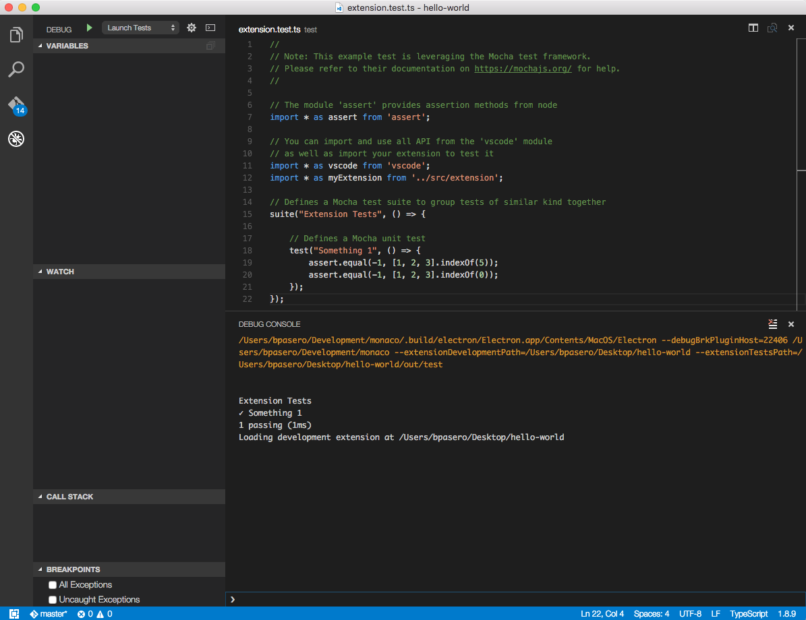

# 扩展（以下简称插件）测试

VS Code支持符合 VS Code API 的插件测试的运行和调试。这些测试会在 VS Code内部一个特殊实例内运行，`Extension Development Host`有全套 API的权限。我们把这些测试看做集成测试，因为他们有别于可以可以运行在一个 VS Code 单独窗口的单元测试。本篇文档有关 VS Code 集成测试。对于但与测试，你可以使用任何时髦的测试框架，比如[Mocha](http://mochajs.org/)或者 [Jasmine](http://jasmine.github.io/)。

## Yo Code 测试脚手架

[yo code 生成器](/md/工具/yocode扩展生成器.md) 插件项目包含一个测试样例还有支持其运行的必要基础设施。

**说明**: 接下来的文档建立在你已经创建了一个 TypeScript或者 JavaScript 插件的基础上，但是有些文件命名可能比较特别。

在你创建一个插件，在VS Code 上打开时，你可以从调试视图的顶部下拉菜单里进行`Launch Tests`配置


该配置被选中时，运行`Debug: Start`(`kb(workbench.action.debug.start)`)，VS Code会在`Extension Development Host`实例上启动你的插件。你可以看到测试结果会在调试控制台上输出。



该测试使用[Mocha测试框架](http://mochajs.org/) 来做为测试运行库.

该插件项目有一个包含`index.js`文件（配置 Mocha 测试库），`extension.test.js`（存在`Something 1`测试样例）的`test`文件夹。可以不编辑`index.ts`，但是你也可以修改它来调整Mocha 配置。

```bash
├── test
│   ├── extension.test.ts
│   └── index.ts
```

可以在`test`目录下创建更多的`test.ts`文件，之后他们会自动构建并运行在`out/test`目录下。测试库只会运行`*.test.ts`文件。

## 启动测试配置

`Launch Tests` 配置在项目的`.vscode\launch.json`文件中定义。和带有`--extensionTestsPath`参数的`Launch Extension`配置类似，指向编译好的测试文件（假定这是一个 TypeScript 项目）。

```json
{
    "name": "Launch Tests",
    "type": "extensionHost",
    "request": "launch",
    "runtimeExecutable": "${execPath}",
    "args": ["--extensionDevelopmentPath=${workspaceRoot}", "--extensionTestsPath=${workspaceRoot}/out/test" ],
    "stopOnEntry": false,
    "sourceMaps": true,
    "outDir": "${workspaceRoot}/out/test",
    "preLaunchTask": "npm"
}
```

## 给Extension Development Host传递参数

可以在启动配置的参数列表开头，插入测试用例应该打开的文件或者目录

```json
"args": ["file or folder name", "--extensionDevelopmentPath=${workspaceRoot}", "--extensionTestsPath=${workspaceRoot}/out/test" ],
```

这样，你就可以运行带有可预测内容和目录结构的测试。

## 在插件包内排除测试文件

你想要分享插件的话，插件不会包含测试文件吧。[`.vscodeignore`](/md/工具/vse命令行工具.md#advance-usage)文件允许你在通过[`vsce`发布工具](/md/工具/vse命令行工具.md)打包，发布插件的时候排除测试文件。默认地，`yo code`生成好的插件项目排除了`test`，和`out/test`目录。

```
out/test/**
test/**
```

## 在Travis CI构建机器上自动运行测试

你可以在[Travis CI](http://travis-ci.org)这样的构建机器上自动运行插件测试。

`vscode`npm 模块提供了测试命令，用来开启插件测试自动化：

* 下载并解压 VS Code
* 启动 VS Code 内部的插件测试
* 在控制台输出结果，测试成功或者失败返回结束码。

为了开启这条测试命令，打开`package.json`，增加下列入口到`scripts`字段上：

```json
"test": "node ./node_modules/vscode/bin/test"
```

可以轻易的通过这样的顶级`.travis.yml`配置来开启Travis Ci：

```yml
sudo: false

os:
  - osx
  - linux

before_install:
  - if [ $TRAVIS_OS_NAME == "linux" ]; then
      export CXX="g++-4.9" CC="gcc-4.9" DISPLAY=:99.0;
      sh -e /etc/init.d/xvfb start;
      sleep 3;
    fi

install:
  - npm install
  - npm run vscode:prepublish

script:
  - npm test --silent
```

以上脚本会在 Linux 和 Mac OS X 上跑测试用例。需要注意为了在 Linux 上运行测试用例，你需要有`before_install`配置使得 Linux 在构建时启动 VS Code。

**说明:** 现在我们不支持在 Windows 上跑测试用例（比如使用 Appveyor）。

有一些用来配置测试库的可选环境变量；

| 名称        | 描述       |
| ------------|-------------------|
| `CODE_VERSION` | 跑测试用例的 VS Code版本 (比如 `0.10.10`) |
| `CODE_DOWNLOAD_URL` | 可以跑测试用例的VS Code的完整下载地址 |
| `CODE_TESTS_PATH` | 要排除的测试文件夹 |
| `CODE_TESTS_WORKSPACE` | 打开测试实例的工作区间 |

## 下一步

* [插件调试](/md/扩展/调试-扩展.md) - 学习如何运行并调试插件
* [vsce](/md/工具/vse命令行工具.md) - 通过 VSCE 命令行工具发布插件.
* [插件清单文件](/md/扩展API/扩展manifest文件.md) - VS Code 插件清单文件指南
* [插件 API](/md/扩展API/概述.md) - 了解 VS Code 可扩展性 API

## 常见问题

暂无。
