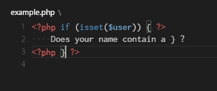
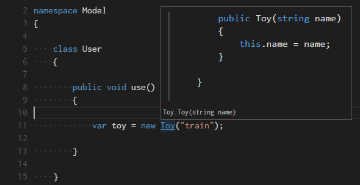
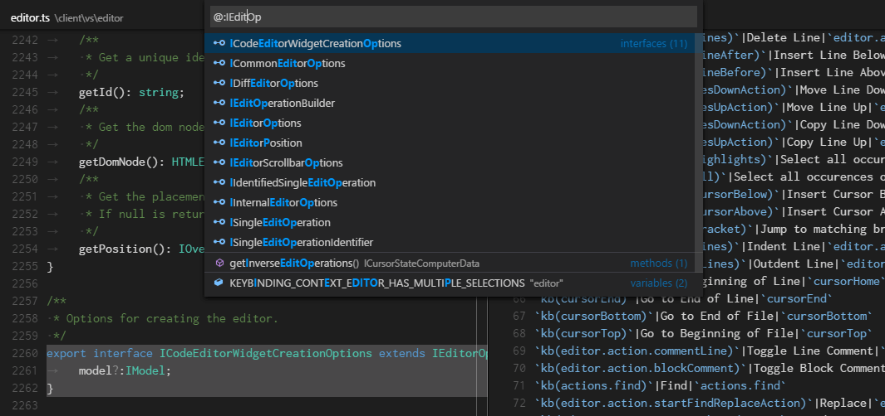
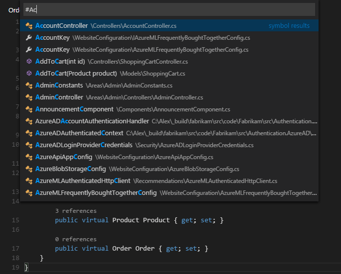
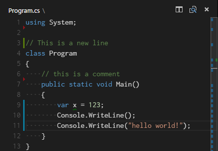
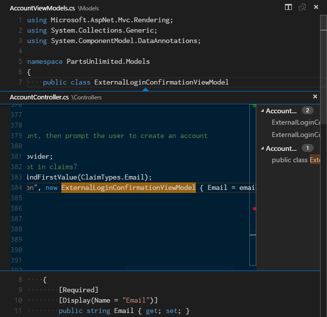
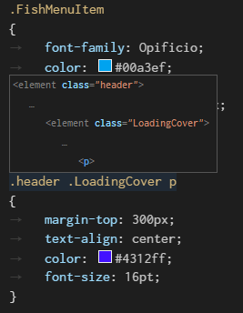
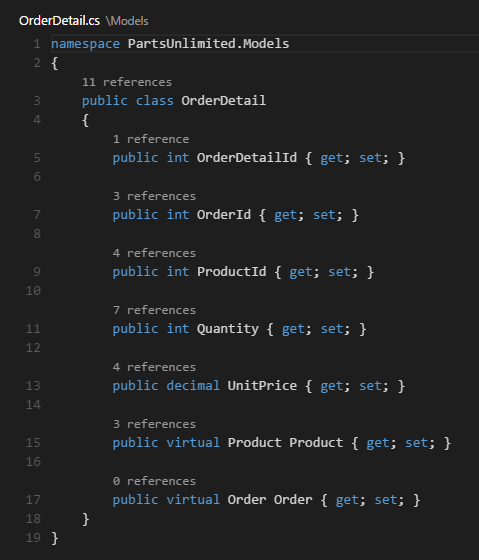
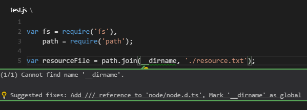

# Editing Evolved - 与时俱进的编辑体验

Visual Studio Code features a battle-tested code editor that has most of the industry standard features, but also has some delights. We've been using it to build VS Code and we hope you'll love it too. This topic will walk you through some of the notable features of the code editor.

Visual Studio Code是一款经过考验的编辑器，拥有大多数已成产业标准的特点，但同时也有惊喜。我们用这些构建出的VS Code，希望你也能爱上它。本主题将向你介绍VS Code的那些值得注意的特点。

## Bracket matching - 括号匹配

Matching brackets will be highlighted as soon as the cursor is near one of them. The right bracket will always be found, regardless of embedded languages.

当光标接近一个括号时，与之配对的括号就会高亮显示。右括号总是会被发现，不管其嵌入的是何种语言。



> **Tip:** You can jump to the matching bracket with `⇧⌘\` 
>
> **小技巧**：你可以使用快捷键`⇧⌘\`直接跳转到匹配的括号处。（Windows or Linux：`Ctrl+Shift+\`）

## Selection & Multi-cursor - 挑选 & 动态多光标

VS Code has support for multiple cursors. You can add secondary cursors (rendered thinner) with `Alt+Click`. Each cursor operates independently based on the context it sits in. The most common way to add more cursors is with `ctrl+alt+down` or `Ctrl+Alt+Up` that insert cursors below or above.

VS Code支持动态多光标。你可以使用`Alt+Click`的方式添加第二光标（被渲染为较细的光标）。每个光标课根据其所在位置的上下文独立操作。最常用的多光标添加方式是使用快捷键`⌥⌘↓`或`⌥⌘↑`向上或下插入光标。（Window：`Ctrl+Alt+Down`或`Ctrl+Alt+Up` Linux：`Shift+Alt+Down`或`Shift+Alt+Up`）

> **Note:** Your graphics card provider might overwrite these default shortcuts.
>
> **注意**：你的显卡提供商可能会重写这些快捷按键。


`ctrl+d` selects the word at the cursor, or the next occurrence of the current selection.  `Ctrl+K Ctrl+D` moves the last added cursor to next occurrence of the current selection.

`⌘D`选择光标处的词，或下一个选中词出现的位置。`⌘K` `⌘D`将添加一个光标到下一个选中词所出现的位置。


> **Tip:** You can add more cursors also with `ctrl+shift+l`, which will add a selection at each occurrence of the current selected text or with `Ctrl+F2`, which will add a selection at each occurrence of the current word.
>
> **小贴士**：你也可以使用`⇧⌘L`在每个出现选中文本处添加一个光标，或使用`⌘F2`在每个出现当前词的位置添加光标。（Window：`Ctrl+Shift+L`、`Ctrl+F2` Linux：`Ctrl+Shift+L`、`Ctrl+F2`）

### Column text selection - 选择一列文本

Hold `Shift` and `Alt` while dragging to do column text selection:

按住`Shift`或`Alt`时，用鼠标拖动可以按列选择文本：


There are also default key bindings for column selection on OS X and Windows, but not on Linux. You can [edit](/md/定制化/快捷键绑定.md) your `keybindings.json` to bind them to something more familiar if you wish.

在OS X和Windows上同样有一些默认的列文本选择快捷键可以设置，很遗憾Linux没有这一功能。你可以[编辑](../定制化/快捷键绑定.md)你的`keybindings.json`文件来绑定快捷键到你希望的组合。

For example:

例如：

```json
{ "key": "shift+alt+down",     "command": "cursorColumnSelectDown",
                                  "when": "editorTextFocus" },
{ "key": "shift+alt+left",     "command": "cursorColumnSelectLeft",
                                  "when": "editorTextFocus" },
{ "key": "shift+alt+pagedown", "command": "cursorColumnSelectPageDown",
                                  "when": "editorTextFocus" },
{ "key": "shift+alt+pageup",   "command": "cursorColumnSelectPageUp",
                                  "when": "editorTextFocus" },
{ "key": "shift+alt+right",    "command": "cursorColumnSelectRight",
                                  "when": "editorTextFocus" },
{ "key": "shift+alt+up",       "command": "cursorColumnSelectUp",
                                  "when": "editorTextFocus" }
```

### Shrink/expand selection - 收缩、展开选择文本段

Quickly shrink or expand the current selection (applies to all languages). Trigger it with `Shift+Alt+Left` and `Shift+Alt+Right`

快速收缩或展开选择当前选中文本段（适用于所有语言），只需要按`⌃⇧⌘←`或`⌃⇧⌘→`即可。（在Windows或Linux上请按`Shift+Alt+Left`或`Shift+Alt+Right`）

Here's an example of expanding the selection with `Shift+Alt+Right`:

以下是一个展开选择的例子，使用按键`⌃⇧⌘→`（`Shift+Alt+Right`）：


## IntelliSense - 智能感知

We'll always offer word completion, but for the rich [languages](/md/语言/overview.md), such as JavaScript, JSON, HTML, CSS, Less, Sass, C# and TypeScript, we offer a true IntelliSense experience. 

我们将会提供代码补全，但对于丰富的[语言](/md/语言/overview.md)，例如JavaScript, JSON, HTML, CSS, Less, Sass, C# 和 TypeScript，我们提供一个真正的智能感知的体验。

If a language service knows possible completions, the IntelliSense suggestions will pop up as you type (we call it affectionately 24x7 IntelliSense). You can always manually trigger it with `Ctrl+Space`.  

如果一个语言服务知道代码可能如何完成，智能感知代码建议将会弹出随着您的键入（我们亲切地称它为24x7智能感知）。 你也可以通过用`Ctrl+Space`触发它。

Out of the box, `.`, `Tab)` or `Enter` are accept triggers but you can also [customize these key bindings](/md/定制化/快捷键绑定.md).

开箱即用，`.`, `Tab` or `Enter` 是接收快捷键的，但您也可以[自定义绑定快捷键](/md/定制化/快捷键绑定.md)。


> **Tip:** The suggestions filtering supports CamelCase so you can type the upper case letters of a method name to limit the suggestions. For example, "wl" will quickly bring up WriteLine.


> **Tip:** The 24x7 IntelliSense can be configured via the `editor.quickSuggestions` and `editor.suggestOnTriggerCharacters` [settings](/md/定制化/用户和工作空间.md).

## Parameter Hints

In JavaScript, TypeScript or C#, parameter hints will pop up as you're typing a method invocation. You can navigate between different overloads with `Up` and `Down` and the best overload will be presented based on the arguments you pass in.


## Snippets and Emmet Abbreviations

We offer built-in snippets across languages as well as support for [Emmet abbreviations](http://docs.emmet.io/). You can expand Emmet abbreviations in HTML, Razor, CSS, Less, Sass, XML or Jade with `Tab`.


(See the [Emmet cheat sheet](http://docs.emmet.io/cheat-sheet/) for syntax examples.)

You can also define your own snippets: Open **User Snippets** under **File** > **Preferences** and select the language for which the snippets should appear. Find out more about this in the [customization section](/md/定制化/用户定义代码段.md) of our docs.

## Go to Definition

If a [language](/md/语言/overview.md) supports it, you can go to the definition of a symbol by pressing `F12`.

If you press `Ctrl` and hover over a symbol, a preview of the declaration will appear:



> **Tip:** You can jump to the definition with `Ctrl+Click` or open the definition to the side with `Ctrl+Alt+Click`. If you opened a new editor window, you can go back to the previous editor with `Up`.

## Goto Symbol

You can navigate symbols inside a file with `Ctrl+Shift+O`. By typing `:` the symbols will be grouped by category. Just press `Up` or `Down` and navigate to the place you want.



## Open symbol by name

In C# and in TypeScript, you can jump to a symbol across files with `Ctrl+T`. Just type the first letter of a type you want to navigate to, regardless of which file contains it, and press `Enter`.




## Folding

You can fold regions of source code using the folding icons on the gutter between line numbers and line start. Move the mouse over the gutter to fold and unfold regions.
The folding regions are evaluated based on the indentation of lines. A folding region starts when a line has a smaller indent than one or more following lines, and ends when there is a line with the same or smaller indent.

You can also use the following actions:

* Fold (`Ctrl+Shift+[`) folds the innermost uncollapsed region at the cursor
* Unfold (`Ctrl+Shift+]`) unfolds the collapsed region at the cursor
* Fold All (`Ctrl+K Ctrl+0`) folds all region in the editor
* Unfold All (`Ctrl+K Ctrl+J`) unfolds all regions in the editor
* Fold Level X (`ctrl+k ctrl+2` for level 2) folds all regions of level X, except the region at the current cursor position


## Gutter indicators

If you open a folder that is a Git repository and begin making changes, VS Code will add useful annotations to the gutter and to the overview ruler.

* A red triangle indicates where lines have been deleted
* A green bar indicates new added lines
* A blue bar indicates modified lines



## Peek

We think there's nothing worse than a big context switch when all you want is to quickly check something. That's why we support peeked editors. When you execute a Reference Search (via `Shift+F12`), or a Peek Definition (via `Alt+F12`), we embed the result inline:



> **Tip:** You can navigate between different references in the peeked editor and, if you need to, you can even make quick edits right there!


> **Tip:** Clicking on the peeked editor filename or double-clicking in the result list will open the reference in the outer editor.

## Hover

For languages that support it, the hover will show useful information, such as types of symbols, or, in the case of CSS below, the shape of the HTML that would match a certain CSS rule:



## Reference information

C# supports inline reference information, that is live updated. This allows you to quickly analyze the impact of your edit or the popularity of your specific method or property throughout your project:



> **Tip:** Directly invoke the Find References action by clicking on these annotations.


> **Tip:** Reference information can be turned on or off through the `editor.referenceInfos` setting.

## Rename symbol

TypeScript and C# support rename symbol across files. Simply press `F2` and then type the new desired name and press `Enter`. All usages of the symbol will be renamed, across files.


## Errors & Warnings

Warnings or Errors can be generated either via [configured tasks](/md/编辑器/任务.md) or by the rich language services, that constantly analyze your code in the background. Since we love bug-free code, warnings and errors show up in multiple places:

* In the status line there is a summary of all errors and warnings counts.
* You can click on the summary or press `Ctrl+Alt+O` to see a list of all current errors.
* If you open a file that has errors or warnings, they will be rendered inline with the text and in the overview ruler.


> **Tip:** To loop through errors or warnings in the current file, you can press `F8` or `shift+alt+f8` which will show an inline zone detailing the problem and possible code actions (if available):



## Next Steps

Now that you know how the editor works, time to try a few other things...

* [Why VS Code](/md/编辑器/为什么选用VSCode.md) - Why we exist and where we think we can help
* [The Basics](/md/编辑器/基础.md) - Basic orientation around VS Code
* [Debugging](/md/编辑器/调试.md) - This is where VS Code really shines
* [Customization](/md/定制化/概述.md) - Configure VS Code the way you want - Themes, Settings

