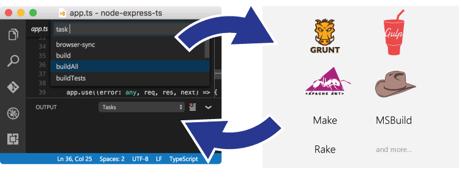
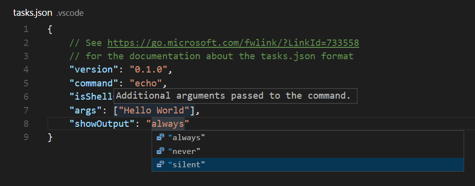
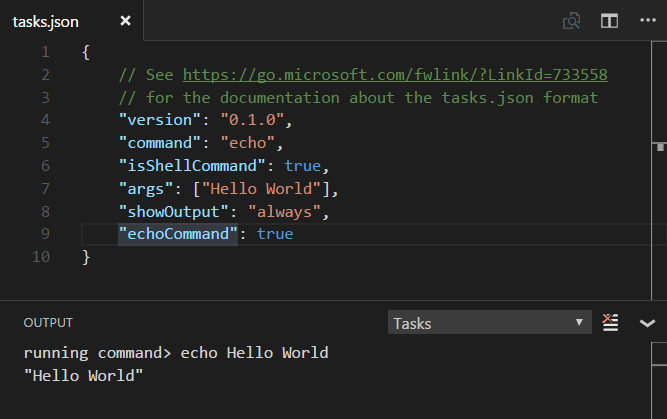
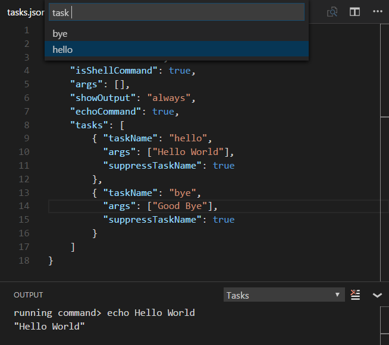
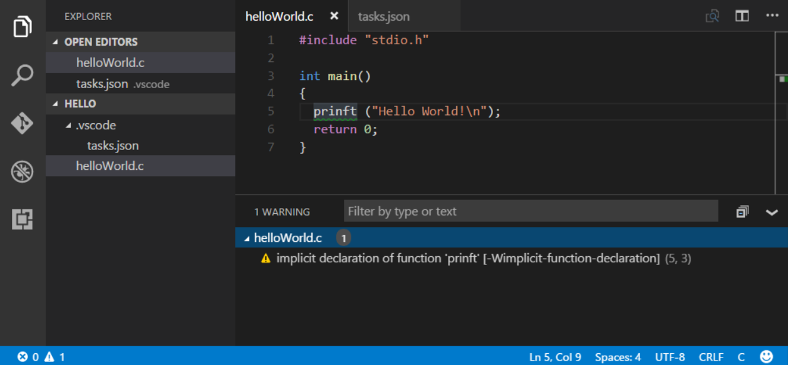

# 通过任务集成外部工具 Integrate with External Tools via Tasks 

存在很多工具来使构建， 打包，测试或部署软件系统一类的任务自动运行。这些例子中有[Make](https://en.wikipedia.org/wiki/Make_software), [Ant](http://ant.apache.org/), [Gulp](http://gulpjs.com/), [Jake](http://jakejs.com/), [Rake](http://rake.rubyforge.org/) and [MSBuild](https://github.com/Microsoft/msbuild)。

Lots of tools exist to automate tasks like building, packaging, testing or deploying software systems. Examples include [Make](https://en.wikipedia.org/wiki/Make_software), [Ant](http://ant.apache.org/), [Gulp](http://gulpjs.com/), [Jake](http://jakejs.com/), [Rake](http://rake.rubyforge.org/) and [MSBuild](https://github.com/Microsoft/msbuild).



这些工具大多数是从命令行启动，并且自动运行的工作是在软件开发循环(编辑，编译，测试和调试)之外。考虑到他们在开发生命周期中的重要性，如果能在VS Code中运行他们并且分析结果将会是非常有帮助的。

These tools are mostly run from the command line and automate jobs outside the inner software development loop (edit, compile, test and debug).  Given their importance in the development life-cycle, it is very helpful to be able run them and analyze their results from within VS Code.

>请注意任务支持只在打开一个工作空间文件夹时可用。它在编辑单独的文件时不可用。

>Please note that task support is only available when working on a workspace folder. It is not available when editing single files.


## 你好，世界 Hello World 

让我们从一个简单的"Hell Wrold"任务开始，它运行时会在**输出**面板上显示文字。

Let's start with a simple "Hello World" task which will display text to the **OUTPUT** panel when run.

在工作空间的`task.json`文件中定义任务，VS Code有一些一般的任务运行器的模版。在**命令面板** (`Ctrl+Shift+P or F1`)中，你可以使用'任务'过滤然后看到不同的关于任务的命令。

Tasks are defined in a workspace `tasks.json` file and VS Code has templates for common task runners. In the **Command Palette** (`Ctrl+Shift+P or F1`), you can filter on 'task' and can see the various Task related commands.


选择**任务: 配置任务运行程序** 命令，你将看到一个任务运行器的列表。选择**运行任意外部命令的示例**来创建一个运行外部命令的任务。

Select the **Tasks: Configure Task Runner** command and you will see a list of task runner templates. Select **Others** to create a task which runs an external command.

你现在应该在你的工作空间的`.vscode`文件夹下看到一个`tasks.json`的文件，里面的内容是如下:

You should now see a `tasks.json` file in your workspace `.vscode` folder with the following content:

```json
{
    "version": "0.1.0",
    "command": "echo",
    "isShellCommand": true,
    "args": ["Hello World"],
    "showOutput": "always"
}
```

在这个例子中，我们只是运行了`echo`，参数为"Hello World"的shell命令。

In this example, we are just running the `echo` shell command with "Hello World" as an argument.

运行**任务: 运行任务**测试这个`echo`任务，然后选择从下拉框中选择`echo`。**输出**将打开，你将看到"Hello World"的文本。

Test the `echo` task by running **Tasks: Run Tasks** and selecting `echo` from the dropdown. The **OUTPUT** panel will open and you'll see the text "Hello World".

你在编辑`tasks.json`时鼠标移动到上面时可以得到关于变量键值的智能感知和使用`Ctrl+Space`的自动补全。

You can get IntelliSense on `tasks.json` variables and their values with hover and trigger smart completions with `Ctrl+Space`.



>**提示:**你可以键入'任务', `Space` 和任务名称通过**快速打开**(`Ctrl+P`)运行你的任务。在这个例子中是'task echo'。

>**Tip:** You can run your task through **Quick Open** (`Ctrl+P`) by typing 'task', `Space` and the command name. In this case, 'task echo'.

## 输出窗口的行为 Output Window Behavior

有时你希望在运行任务时控制输出窗口的行为。比如你可能希望最大化编辑器空间并且只在你认为有问题时查看任务输出。这由**showOutput**属性控制，合理的值有:

Sometimes you will want to control how the output window behaves when running tasks. For instance, you may want to maximize editor space and only look at task output if you think there is a problem. The property **showOutput** controls this and the valid values are:

- **always** - The output window is always brought to front. This is the default.
- **always** - 输出窗口永远被放到前台。这是默认值。

- **never** - The user must explicitly bring the output window to the front using the **View** > **Toggle Output** command (`Ctrl+Shift+U`).
- **never** - 用户必须明确使用**查看** > **输出**(`Ctrl+Shift+U`)命令将输出窗口放到前台.

- **silent** - The output window is brought to front only if no [problem matchers](/md/编辑器/任务.md#processing-task-output-with-problem-matchers) are set for the task.
- **silent** - 只有当没有设置[问题匹配器](/md/编辑器/任务.md#processing-task-output-with-problem-matchers)时输出窗口才会被放到前台。

### 输出命令 echoCommand

为了看到VS Code正在运行的命令,如果可以启用`tasks.json`里的`echoCommand`选项：

To see the exact command VS Code is running, you can enable the `echoCommand` setting in `tasks.json`:



>**注意:** VS Code 运行 npm, MSBuild, maven 和其他命令行工具。一个学习任务的很好的方法是查看这些模版查看哪些工具或者任务运行器与你可能用到的其他工具相似。

>**Note:** VS Code ships with predefined `tasks.json` templates to run npm, MSBuild, maven and other command line tools. A great way to learn about tasks is to review these templates and see which tools or task runners are similar to other tools you may be using.

## 命令和任务数组 command and tasks[]

`tasks.json` 接受单一的 `command` 值，它可能是一个像 gulp, grunt 或者一切像编译器或者检查器的命令行工具的任务运行器。默认的`command`将会显示在**任务: 运行任务**的下拉框中。

`tasks.json` takes a single `command` value which can be a task runner like gulp or grunt or any command line tool like a compiler or linter. By default the `command` will show up in the **Tasks: Run Task** dropdown.

你也可以在`tasks`数组中定义多个任务来在运行`command`时传递不同的参数或使用不同的设置。

You can also define multiple tasks in a `tasks` array in order to pass different arguments or use different settings when the `command` is run.

这里是一个简单的传递不同参数给`echo`命令的例子：

Here's a simple example passing different arguments to the `echo` command:

```json
{
    "version": "0.1.0",
    "command": "echo",
    "isShellCommand": true,
    "args": [],
    "showOutput": "always",
    "echoCommand": true,
    "suppressTaskName": true,
    "tasks": [
        { "taskName": "hello",
          "args": ["Hello World"],
        },
        { "taskName": "bye",
          "args": ["Good Bye"],
        }
    ]
}
```

现在当你运行**任务: 运行任务**时，你将看到在下拉框中看到`hello`和`bye`两个任务。我们设置`suppressTaskName`为真，因为默认情况下任务名称也传递给命令，这样的结果是"echo hello Hello World"。

Now when you run **Tasks: Run Task**, you will now see two tasks in the dropdown `hello` and `bye`. We set `suppressTaskName` to true as by default the task name is also passed to the command which would result in "echo hello Hello World".



一些在`task.json`中的属性，像`showOutput` 和 `suppressTaskName`，可以被设置为全局然后被特定任务重写。这些任务数组的`args`属性值被添加到全局参数。

Some `tasks.json` properties such as `showOutput` and `suppressTaskName` can be set both globally and then overridden in specific tasks. The `tasks` `args` property values are appended to the global arguments.

任务数组也有一些的特定属性。一个有用的属性是`isBuildCommand`，如果它被设置为真，会从**任务: 运行生成任务**`kb(workbench.action.tasks.build)`中运行。

There are also `tasks` specific properties. One useful property is `isBuildCommand`, which if set to true, will run the task with the **Tasks: Run Build Task** (`kb(workbench.action.tasks.build)`) command.

## 运行多种命令 Running multiple commands

要是你想在你的工作空间中运行不同的命令行工具怎么办？在`tasks.json`中定义不同的任务并没有被VS Code完全支持(参见 [#981](https://github.com/Microsoft/VS Code/issues/981))。你可以通过一个Shell命令(Linux 和 OS X上的`sh`， Windows上的`cmd`)运行你的任务命令来绕过这个限制。

What if you want to run different command line tools in your workspace? Defining multiple tasks in `tasks.json` is not yet fully supported by VS Code (see [#981](https://github.com/Microsoft/vscode/issues/981)). You can work around this limitation by running your task commands through a shell command (`sh` on Linux and OS X, `cmd` on Windows).

这里是一个添加`make`和`ls`两个命令的示例：

Here is an example to add two tasks for `make` and `ls`:

```json
{
    "version": "0.1.0",
    "command": "sh",
    "args": ["-c"],
    "isShellCommand": true,
    "showOutput": "always",
    "suppressTaskName": true,
    "tasks": [
        {
            "taskName": "make",
            "args": ["make"]
        },
        {
            "taskName": "ls",
            "args": ["ls"]
        }
    ]
}
```

`make` 和 `ls` 两个命令将在**任务: 运行任务**下拉框中可见。

Both tasks `make` and `ls` will be visible in the **Tasks: Run Task** dropdown.

在Windows上, 你需要传递 '/C' 参数给 `cmd` 来运行任务.

For Windows, you will need to pass the '/C' argument to `cmd` so that the tasks arguments are run.

```json
    "command": "cmd",
    "args": ["/C"]
```

## 变量替换 Variable substitution

当创作任务配置时，一写预先定义的一般变量经常很有用。VS Code支持`tasks.json`中字符串里的变量替换，并且提供以下预先定义的变量:

When authoring tasks configurations, it is often useful to have a set of predefined common variables.  VS Code supports variable substitution inside strings in the `tasks.json`  file and has the following predefined variables:

- **${workspaceRoot}** VS Code中打开的文件夹的路径
- **${workspaceRoot}** the path of the folder opened in VS Code

- **${file}** 当前打开的文件路径
- **${file}** the current opened file

- **${relativeFile}** 当前打开的文件相对于`workspaceRoot`的路径
- **${relativeFile}** the current opened file relative to `workspaceRoot`

- **${fileBasename}** 当前打开的文件的basename
- **${fileBasename}** the current opened file's basename

- **${fileDirname}** 当前打开的文件的文件夹名
- **${fileDirname}** the current opened file's dirname

- **${fileExtname}** 当前打开的文件扩展名
- **${fileExtname}** the current opened file's extension

- **${cwd}** 任务运行器启动时的当前路径
- **${cwd}** the task runner's current working directory on startup

你也可以使用**${env.Name}** (比如 ${env.PATH})来引用环境变量。请确认它匹配环境变量的大小写，比如Windows上的`env.Path`。

You can also reference environment variables through **${env.Name}** (e.g. ${env.PATH}). Be sure to match the environment variable name's casing, for example `env.Path` on Windows.

下面是一个传递当前打开的文件给TypeScript编译器的配置项的例子。

Below is an example of a configuration that passes the current opened file to the TypeScript compiler.

```json
{
    "command": "tsc",
    "args": ["${file}"]
}
```

## 操作系统特有的属性  Operating System Specific Properties

任务系统支持定义不同的变量(比如要运行的命令)给特定的操作系统。要这样做，只需要在`tasks.json`中添加一个操作系统特定的字面量并且在字面量中指定相符合的属性。

The task system supports defining values (for example, the command to be executed) specific to an operating system. To do so, simply put an operating system specific literal into the `tasks.json` file and specify the corresponding properties inside that literal.

下面是一个使用Node.js可执行文件作为命令的例子，并且它对Windows和Linux做了不同的对待：

Below is an example that uses the Node.js executable as a command and is treated differently on Windows and Linux:

```json
{
    "version": "0.1.0",
    "windows": {
        "command": "C:\\Program Files\\nodejs\\node.exe"
    },
    "linux": {
        "command": "/usr/bin/node"
    }
}
```

合法的操作系统属性包括"windows", "linux"和"osx"。特定操作系统中定义的属性将重写全局范围定义的属性。

Valid operating properties are `windows` for Windows, `linux` for Linux and `osx` for Mac OS X. Properties defined in an operating system specific scope override properties defined in the global scope.

在下面的例子中:

In the example below:

```json
{
    "version": "0.1.0",
    "showOutput": "never",
    "windows": {
        "showOutput": "always"
    }
}
```

运行的任务的输出在其他系统中永远不会放在前台，但是在Windows中它永远显示。

Output from the executed task is never brought to front except for Windows where it is always shown.

## 任务的例子 Examples of Tasks in Action

最好的突出任务作用的方法是提供几个VS Code使用任务来集成检查器和编译器的例子。

To highlight the power of Tasks, here are a few examples of how VS Code can use Tasks to integrate external tools like linters and compilers.

### 编译Typescript到Javascript Transpiling TypeScript to JavaScript

[TypeScript主题](/md/语言/typescript.md#transpiling-typescript-into-javascript) 包含了一个创建一个任务来编译TypeScript到JavaScript并且在VS Code中观察任何相关的错误的例子。

The [TypeScript topic](/md/语言/typescript.md#transpiling-typescript-into-javascript) includes an example that creates a task to transpile TypeScript to JavaScript and observe any related errors from within VS Code.

### 编译Markdown到HTML Compiling Markdown to HTML

Markdown主题提供了两个编译Markdown到HTML的例子。

The Markdown topic provides two examples for compiling Markdown to HTML:

1. [通过构建项目手动编译](/md/语言/markdown.md#compiling-markdown-into-html)
1. [通过文件观察者自动编译](/md/语言/markdown.md#automating-markdown-compilation)

1. [Manually compiling with a Build task](/md/语言/markdown.md#compiling-markdown-into-html)
2. [Automation of the compile step with a file watcher](/md/语言/markdown.md#automating-markdown-compilation)

### 编译Sass和Less到CSS Transpiling Less and Sass into CSS

CSS主题提供了怎样使用任务生成CSS文件的例子。

The CSS topic provides examples of how to use Tasks to generate CSS files.

1. [通过构建项目手动编译](/md/语言/css.md#transpiling-sass-and-less-into-css)
1. [通过文件观察者自动编译](/md/语言/css.md#automating-sassless-compilation)

1. [Manually transpiling with a Build task](/md/语言/css.md#transpiling-sass-and-less-into-css)
2. [Automation of the compile step with a file watcher](/md/语言/css.md#automating-sassless-compilation)

## 自动发现Gulp， Grunt 和 Jake 任务 Autodetecting Gulp, Grunt and Jake Tasks

VS Code可以自动发现包含Gulp, Grunt 和 Jake文件。不需要额外的配置来添加它们的任务到任务列表中（除非你需要使用一个问题匹配器，稍后再作更多的介绍）。

VS Code can autodetect tasks from within Gulp, Grunt and Jake files.  This adds their tasks to the task list without requiring additional configuration (unless you need to use a problem matcher, more on that in a moment).

为了使这个例子更加具体，我们使用一个简单的Gulp文件。这里定义了两个任务：构建和调试。第一个使用[Mono](http://www.mono-project.com/)的编译器编译了C#代码，第二个在Mono调试器下启动MyApp。

To help make this example more concrete, let's use this simple Gulp file.  This defines two tasks: build and debug. The first compiles C# code using [Mono](http://www.mono-project.com/)'s compiler. The second starts the MyApp under the Mono debugger.

```javascript
var gulp = require("gulp");

var program = "MyApp";
var port = 55555;

gulp.task('default', ['debug']);

gulp.task('build', function() {
    return gulp
        .src('./**/*.cs')
        .pipe(msc(['-fullpaths', '-debug', '-target:exe', '-out:' + program]));
});

gulp.task('debug', ['build'], function(done) {
    return mono.debug({ port: port, program: program}, done);
});
```

处理 `Ctrl+Shift+P or F1` 然后键入 `Run Task` 加上 `Enter` 将显示所有可得的任务。选择一个然后按 `Enter` 将执行这个任务。

Pressing `Ctrl+Shift+P or F1` and then typing `Run Task` followed by `Enter` will list all available tasks. Selecting one and pressing `Enter` will execute the task.


>**注意:** Gulp, Grunt 和 Jake 只有在相符合的文件(比如 `gulpfile.js`) 在打开的文件夹的根部录下存在时才会自动发现。

>**Note:** Gulp, Grunt and Jake are autodetected only if the corresponding files (for example `gulpfile.js`) are present in the root of the opened folder.

## 使用问题匹配器处理任务输出 Processing Task Output with Problem Matchers

VS Code使用问题匹配器处理任务的输出，然后我们在'箱子里'使用它们：

VS Code can process the output from a task with a problem matcher and we ship with a number of them 'in the box':

- **TypeScript**: `$tsc` assumes that file names in the output are relative to the opened folder.
- **TypeScript Watch**: `$tsc-watch` matches problems reported from the `tsc` compiler when executed in watch mode.
- **JSHint**: `$jshint` assumes that file names are reported as an absolute path.
- **JSHint Stylish**: `$jshint-stylish` assumes that file names are reported as an absolute path.
- **ESLint Compact**: `$eslint-compact` assumes that file names in the output are relative to the opened folder.
- **ESLint Stylish**: `$eslint-stylish` assumes that file names in the output are relative to the opened folder.
- **CSharp and VB Compiler**: `$mscompile` assumes that file names are reported as an absolute path.
- **Less**: `$lessCompile` assumes that file names are reported as absolute path.

- **TypeScript**: `$tsc` 假定输出中的文件名与打开的文件夹有关。
- **TypeScript Watch**: 当执行观察模式时 `$tsc-watch` 匹配 `tsc` 编译器报告的问题。
- **JSHint**: `$jshint` 假定报告的文件名是一个绝对路径。
- **JSHint Stylish**: `$jshint-stylish` 假定报告的文件名是一个绝对路径。
- **ESLint Compact**: `$eslint-compact` 假定输出中的文件名与打开的文件夹有关。
- **ESLint Stylish**: `$eslint-stylish` 假定输出中的文件名与打开的文件夹有关。
- **CSharp and VB Compiler**: `$mscompile` 假定报告的文件名是一个绝对路径。
- **Less**: `$lessCompile` 假定输出中的文件名与打开的文件夹有关。

问题匹配器扫描任务输出的文本来寻找已知的警告或错误字符串，然后报告在编辑器的问题面板中内联的报告它们。可以全局设置或在特定的任务入口中设置问题匹配器。

Problem matchers scan the task output text for known warning or error strings and report these inline in the editor and in the Problems panel. Problem matchers can be set globally or in a specific task entry.

你也可以创建你自己的问题匹配器，我们将很快讨论它。

You can also create your own problem matcher which we'll talk about soon.

## 将Gulp, Grunt 和 Jake的输出映射到问题匹配器 Mapping Gulp, Grunt and Jake Output to Problem Matchers

你需要设置`tasks.json`(在你的工作空间的`.vscode`文件夹中)文件中的任务如果你选哟做更多的事而不仅仅简单的运行这个任务。比如，你也许想在VS Code中匹配并高亮报告的错误，或者想使用**运行生成任务**(`kb(workbench.action.tasks.build)`)命令来触发生成任务。

You need to configure the tasks in a `tasks.json` file (located under your workspace `.vscode` folder) if you want to do more than simply run the task.  For example, you might want to match reported problems and highlight them within VS Code, or to trigger a build task using the **Tasks: Run Build Task** command (`kb(workbench.action.tasks.build)`).

如果你没有一个在工作空间里的`.vscode`目录下的`tasks.json`文件，运行**命令面板**(`Ctrl+Shift+P or F1`)的**任务: 配置任务运行程序**操作将给你提供一些模版来挑选。

If you don't already have a `tasks.json` under your workspace `.vscode` folder, running the **Tasks: Configure Task Runner** action from the **Command Palette** (`Ctrl+Shift+P or F1`) will offer you a set of templates to pick from.

比如，从列表中选择`Gulp`。这将生成一个类似一下内容的`tasks.json`:

For this example, select `Gulp` from the list. Given a `gulpfile.js` like the example above, this will generate a `tasks.json` file like this:

```json
{
    // See http://go.microsoft.com/fwlink/?LinkId=733558
    // for the documentation about the tasks.json format
    "version": "0.1.0",
    "command": "gulp",
    "isShellCommand": true,
    "args": [
        "--no-color"
    ],
    "tasks": [
        {
            "taskName": "build",
            "args": [],
            "isBuildCommand": true,
            "isWatching": false,
            "problemMatcher": [
                "$lessCompile",
                "$tsc",
                "$jshint"
            ]
        }
    ]
}
```

既然我们运行了Mono编译器来编译C#文件，我们使用`$msCompile`问题匹配器来发现编译器报告的任何问题。

Since we execute the Mono compiler to compile C# files, we should use the `$msCompile` problem matcher to detect any problems reported by the compiler.


这个`problemMatcher` 属性将会是:

The `problemMatcher` property will then be:

```json
            "problemMatcher": [
                "$msCompile"
            ]
```

关于这个`tasks.json`，我们需要注意:

Several things to note about this `tasks.json`:

1. 我们想在shell中运行Gulp命令 (VS Code 直接运行它)，所以我们使用 **isShellCommand**.
2. 我们增加了一个明确的**tasks**属性，它使我们能够 *optionally* augment a task that was in the gulpfile.
3. 我们定义了一个问题匹配器**$msCompile**来处理输出-既然我们正在使用Mono编译器编译C#，内建的一个任务**msc**依赖微软编译模式。
4. `isWatching`属性被设为假所以我们不能在源文件改动时自动运行声称命令。

1. We want to run the gulp command in a shell (VS Code directly executing it) so we used **isShellCommand**.
2. We added an explicit **tasks** property which allowed us to *optionally* augment a task that was in the `gulpfile.js`.
3. We defined a problem matcher **$msCompile** to process the output - since we are compiling C# using the Mono compiler, the built-in one works as *msc* adheres to the Microsoft compiler pattern.
4. The `isWatching` property is set to false so we won't automatically run the build on source code file changes.


## 定义一个问题匹配器 Defining a Problem Matcher

VS Code ships some of the most common problem matchers out of the box.但是，有很多编译器或者检查工具不在这里，它们产生自己独特的错误和警告风格，所以我们来讨论怎样创建你自己的问题匹配器。

VS Code ships some of the most common problem matchers out of the box.  However, there are lots of compilers and linting tools out there, all of which produce their own style of errors and warnings.  So let's talk about how to make your own problem matcher.

我们现在有一个`helloWorld.c`程序，其中开发者将**printf**错误拼写为**prinft**。使用[gcc](https://gcc.gnu.org/)编译它会产生如下警告：

We have a `helloWorld.c` program in which the developer mistyped **printf** as **prinft**. Compiling it with [gcc](https://gcc.gnu.org/) will produce the following warning:

```bash
helloWorld.c:5:3: warning: implicit declaration of function ‘prinft’
```

我们希望产生一个能够购捕捉输出窗口信息的问题匹配器，然后在VS Code中显示相符合的问题匹配器。问题匹配器严重依赖[正则表达式](https://en.wikipedia.org/wiki/Regular_expression)。下面的章节假定你很熟悉正则表达式。

We want to produce a problem matcher that can capture the message in the output and show a corresponding problem in VS Code.  Problem matchers heavily rely on [regular expressions](https://en.wikipedia.org/wiki/Regular_expression). The section below assumes you are familiar with regular expressions.

>**提示:** 我们发现[RegEx101 playground](https://regex101.com/)是一个开发和测试正则表达式的好东西。

>**Tip:** We have found the [RegEx101 playground](https://regex101.com/) a really good way to develop and test regular expressions.

一个捕捉以上警告(和错误)的匹配器看起来是这样：

A matcher that captures the above warning (and errors) looks like:

```json
{
    // The problem is owned by the cpp language service.
    "owner": "cpp",
    // The file name for reported problems is relative to the opened folder.
    "fileLocation": ["relative", "${workspaceRoot}"],
    // The actual pattern to match problems in the output.
    "pattern": {
        // The regular expression. Example to match: helloWorld.c:5:3: warning: implicit declaration of function ‘prinft’ [-Wimplicit-function-declaration]
        "regexp": "^(.*):(\\d+):(\\d+):\\s+(warning|error):\\s+(.*)$",
        // The first match group matches the file name which is relative.
        "file": 1,
        // The second match group matches the line on which the problem occurred.
        "line": 2,
        // The third match group matches the column at which the problem occurred.
        "column": 3,
        // The fourth match group matches the problem's severity. Can be ignored. Then all problems are captured as errors.
        "severity": 4,
        // The fifth match group matches the message.
        "message": 5
    }
}
```

请注意文件，行数和信息属性是强制的。

Please note that the file, line and message properties are mandatory.

这是一个以上代码完整(去除注释)的具有实际任务细节的`tasks.json`文件：

Here is a finished `tasks.json` file with the code above (comments removed) wrapped with the actual task details:

```json
{
    "version": "0.1.0",
    "command": "gcc",
    "args": ["-Wall", "helloWorld.c", "-o", "helloWorld"],
    "problemMatcher": {
        "owner": "cpp",
        "fileLocation": ["relative", "${workspaceRoot}"],
        "pattern": {
            "regexp": "^(.*):(\\d+):(\\d+):\\s+(warning|error):\\s+(.*)$",
            "file": 1,
            "line": 2,
            "column": 3,
            "severity": 4,
            "message": 5
        }
    }
}
```

在VS Code中运行它，按`Ctrl+Shift+M`来得到问题的列表，得到以下输出：<!--todo-->

Running it inside VS Code and pressing `Ctrl+Shift+M` to get the list of problems gives you the following output:



这里有一些模式中可以用到的属性:

There are a couple more properties that can be used inside a pattern. These are:

- **location** 如果问题位置是行 或者 行,列 或者 开始行，开始列，结束行，结束列 ，可以使用我们的一般位置匹配组。
- **endLine** 匹配组中问题结束行的索引。当编译器不产生结束行时可以省略。
- **endColumn** 匹配组中问题结束列的索引。当编译器不产生结束列时可以省略。
- **code** 匹配组中出现问题的代码。当编译器不产生代码值时可以省略。

- **location** if the problem location is line or line,column or startLine,startColumn,endLine,endColumn then our generic location match group can be used.
- **endLine** the match group index for the problem's end line. Can be omitted if no end line value is provided by the compiler.
- **endColumn** the match group index for the problem's end column. Can be omitted if no end column value is provided by the compiler.
- **code** the match group index for the problem's code. Can be omitted if no code value is provided by the compiler.

>**注意:**一个可用的模式必须至少提供一个文件，信息和行或者位置的匹配组。

>**Note:** A functional pattern must at least provide a match group for file, message and line or location.

## 定义多行问题匹配器 Defining a Multi-Line Problem Matcher

一些工具将在源文件中找到的问题分散在多行，特别是风格报告器这么用。一个例子是[ESLint](http://eslint.org/)，在风格模式中它产生的输出像这样：

Some tools spread problems found in a source file over several lines, especially if stylish reporters are used. An example is [ESLint](http://eslint.org/); in stylish mode it produces output like this:

```bash
test.js
  1:0   error  Missing "use strict" statement                 strict
✖ 1 problems (1 errors, 0 warnings)
```

我们的问题匹配器是基于行的，所以我们需要使用与实际问题位置和信息(1:0   error  Missing "use strict" statement)不同的正则表达式捕捉文件名(test.js)。

Our problem matcher is line-based so we need to capture the file name (test.js) with a different regular expression than the actual problem location and message (1:0   error  Missing "use strict" statement).

要这么做，我们使用一个问题模式的数组来定义**pattern**属性。这样你可以定义每一行的匹配器来匹配。

To do this we use an array of problem patterns for the **pattern** property. This way you define a pattern per each line you want to match.

以下的问题匹配器匹配ESLint风格模式的输出 - 但是仍然有一个很小问题，我们将在以后解决。以下的代码有一个第一行的正则表达式来捕捉文件名，第二行捕捉 行，列，重要性，信息 和 错误码：

The following problem pattern matches the output from ESLint in stylish mode - but still has one small issue which we will resolve next.  The code below has a first regular expression to capture the file name and the second to capture the line, column, severity, message and error code:

```json
{
    "owner": "javascript",
    "fileLocation": ["relative", "${workspaceRoot}"],
    "pattern": [
        {
            "regexp": "^([^\\s].*)$",
            "file": 1
        },
        {
            "regexp": "^\\s+(\\d+):(\\d+)\\s+(error|warning|info)\\s+(.*)\\s\\s+(.*)$",
            "line": 1,
            "column": 2,
            "severity": 3,
            "message": 4,
            "code": 5
        }
    ]
}
```

当然事情不是一直这么简单， 如果问题多于一个，这个模式不会工作。比如。想象ESLint的以下输出：

Of course it's never quite that simple, and this pattern will not work if there is more than one problem on a resource. For instance, imagine the following output from ESLint:

```bash
test.js
  1:0   error  Missing "use strict" statement                 strict
  1:9   error  foo is defined but never used                  no-unused-vars
  2:5   error  x is defined but never used                    no-unused-vars
  2:11  error  Missing semicolon                              semi
  3:1   error  "bar" is not defined                           no-undef
  4:1   error  Newline required at end of file but not found  eol-last
✖ 6 problems (6 errors, 0 warnings)
```

这个模式的第一行正则表达式将匹配"test.js"， 第二行匹配"1:0  error ..."。下一行的"1:9  error ..."被处理但是不会被第一行的正则表达式捕获所以没捕捉到问题。

The pattern's first regular expression will match "test.js", the second "1:0  error ...". The next line "1:9  error ..." is processed but not matched by the first regular expression and so no problem is captured.

为了使它能够工作，最后一个正则表达式可以指定为**loop**属性。如果它被设置为**true**，它指导任务系统在可以匹配时多次使用多行匹配器的最后一个模式匹配输出的行。

To make this work, the last regular expression of a multi-line pattern can specify the **loop** property. If set to **true**, it instructs the task system to apply the last pattern of a multi-line matcher to the lines in the output as long as the regular expression matches.

所有之前的模式捕捉到的信息都被组合到最后一个模式匹配到的信息，然后成为VS Code的一个问题。

The information captured by all previous patterns is combined with the information captured by the last pattern and turned into a problem inside VS Code.

这里是一个完全捕捉ESLint风格模式的问题匹配器：

Here is a problem matcher to fully capture ESLint stylish problems:

```json
{
    "owner": "javascript",
    "fileLocation": ["relative", "${workspaceRoot}"],
    "pattern": [
        {
            "regexp": "^([^\\s].*)$",
            "file": 1
        },
        {
            "regexp": "^\\s+(\\d+):(\\d+)\\s+(error|warning|info)\\s+(.*)\\s\\s+(.*)$",
            "line": 1,
            "column": 2,
            "severity": 3,
            "message": 4,
            "code": 5,
            "loop": true
        }
    ]
}
```


## 下一步

任务就到这里 - 让我们继续
That was tasks - let's keep going...

* [tasks.json Schema](/docs/editor/tasks_appendix.md) - 你可以检查完整的`tasks.json`概要和描述.
* [Editing Evolved](/md/编辑器/与时俱进的编辑体验.md) - 检查，智能感知，灯泡，获取和转到定义，和更多。
* [Language Support](/md/语言/overview.md) - 通过VS Code和社区插件学习我们怎样支持编程语言。
* [Debugging](/md/编辑器/调试.md) - 直接在VS Code编辑器中调试你的源代码。

* [tasks.json Schema](/docs/editor/tasks_appendix.md) - You can review the full `tasks.json` schema and descriptions.
* [Editing Evolved](/md/编辑器/与时俱进的编辑体验.md) - Lint, IntelliSense, Lightbulbs, Peek and Go to Definition and more.
* [Language Support](/md/语言/overview.md) - Learn about our supported programming languages, both shipped with VS Code and through community extensions.
* [Debugging](/md/编辑器/调试.md) - Debug your source code directly in the VS Code editor.

## 一般问题

**问： 怎样定义运行多个任务来执行不同的命令？**

**Q: How can I define multiple tasks to run different commands?**

**答:** 在`tasks.json`中定义不同的任务并没有被VS Code完全支持(参见 [#981](https://github.com/Microsoft/VS Code/issues/981))。你可以通过一个Shell命令(Linux 和 OS X上的`sh`， Windows上的`cmd`)运行你的任务命令来绕过这个限制。

**A:** Defining multiple tasks in `tasks.json` is not yet fully supported by VS Code (see [#981](https://github.com/Microsoft/VS Code/issues/981)). You can work around this limitation by running your task commands through a shell command (`sh` on Linux and OS X, `cmd` on Windows).

这里是一个添加`make`和`ls`两个命令的示例：

Here is an example to add two tasks for `make` and `ls`:

```json
{
    "version": "0.1.0",
    "command": "sh",
    "args": ["-c"],
    "isShellCommand": true,
    "showOutput": "always",
    "suppressTaskName": true,
    "tasks": [
        {
            "taskName": "make",
            "args": ["make"]
        },
        {
            "taskName": "ls",
            "args": ["ls"]
        }
    ]
}
```

`make` 和 `ls` 两个命令将在**任务: 运行任务**下拉框中可见。

Both tasks `make` and `ls` will be visible in the **Tasks: Run Task** dropdown.

在Windows上, 你需要传递 '/C' 参数给 `cmd` 来运行任务.

For Windows, you will need to pass the '/C' argument to `cmd` so that the tasks arguments are run.

```json
    "command": "cmd",
    "args: ["/C"]
```
