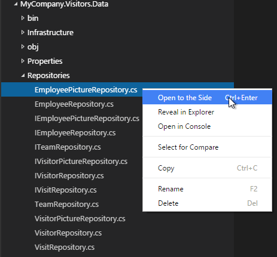
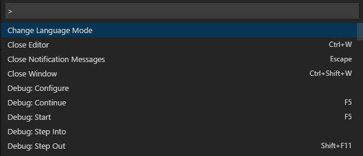

# Visual Studio Code 基础

从骨子里来说，Visual Studio Code 是一款代码编辑器. 跟其它的代码编辑器一样, VS Code 吸取了通用的用户接口和布局：左侧是用于展示所要编辑的所有文件和文件夹的文件管理器，右侧是打开文件的编辑器域。

另外，在VS Code当中还有一些与众不同的特性。在这个主题内将重点描述这些特性。


## 文件（File）, 文件夹（Folders） & 工程（Projects）

VS Code 是基于文件和文件夹的 - 可以在 VS Code中通过打开文件和文件夹立即开始使用.

在这上面，VS Code 可以读取并自用一系列的不同框架和平台定义的工程文件。例如，如果你在VS Code中打开的文件夹中包含一个或多个'package.json'，'project.json'，'tsconfig.json' 亦或者 ASP.net core Visual Studio 解决方案和工程文件，VS Code 将读取这些文件并且利用它们来提供额外的功能，如在编辑器中的丰富的智能感知（IntelliSense）功能。

## 基本布局

VS Code 给我们带来一种简单直观的外观布局，这种布局可以给编辑器提供最大的空间同时又给浏览访问目录或工程上下文提供了充足的空间。整体UI被分成了四个区域：
* **Editor** 用来编辑文件的主体区域。可以并排打开三个编辑器。
* **Side Bar** 包含不同的像浏览器一样的视图来协助来完成工程。
* **Status Bar** 展示当前打开的工程和正在编辑的文件的信息。
* **View Bar** 在最左手边，帮助切换视图以及提供额外的上下文相关的提示，比如激活了Git的情况下，需要提交的变化的数目。

每次打开VS Code的时候，都会回到上一次关闭时的状态。文件夹，布局以及打开的文件都会保存。


除了将文件放在独立的标签页中，VS Code允许一次性打开三个编辑器，可以将最多三个文件并排打开。

这减少了你切换标签页的时间开销，并且不会限制你同时操作的文件数。文件管理器视图含有一个你可以快速打开的文件列表。

>**小技巧：** 你可以将侧边栏移动到右手边(**View** > **Move Sidebar**) 或者将其隐藏(`kb(workbench.action.toggleSidebarVisibility)`).

## 并列编辑

可以最多并排打开三个编辑器.

如果你已经打开一个编辑器，有多种方式可以在旁边打开另一个编辑器：

* 按住`kbstyle(Ctrl)` (Mac: `kbstyle('Cmd')`) 单击文件管理器中的文件
* 使用`kb(workbench.action.splitEditor)`命令来将编辑器拆分为两块
* 在文件管理器中文件右键菜单中单击**Open to the Side** 


任何时候你打开另一个文件，将会显示在当前激活的编辑器中，所以如果你有两个并列编辑器，而你想在右边的编辑器中打开文件"foo.cs"，则打开文件之前必须确保右边的编辑器激活（通过单击编辑器）。

当你打开多个编辑器时，你可以通过按住`kbstyle(Ctrl)` (Mac: `kbstyle('Cmd')`)键并按下`kbstyle(1)`, `kbstyle(2)`或`kbstyle(3)`键来切换编辑器。

>**小技巧：** 你可以通过在编辑器标题区拖拽来对编辑器进行排序和调整大小。

## 文件管理器（Explorer）

文件管理器用来浏览、打开和管理项目内的所有文件和文件夹。

在VS Code中打开文件夹后，文件夹内的内容会显示在文件管理器中，可在此做如下操作：

* 创建、删除、重命名文件和文件夹
* 通过拖拽移动文件和文件夹
* 使用右键菜单操作文件

>**小技巧：** 你可以从VS Code之外拖拽文件到文件管理器来拷贝文件到当前文件夹。



VS Code可以与你是用的其他工具协同工作，特别是命令行工具。如果你想要在当前VS Code中打开文件夹的右键菜单中打开命令行工具，在文件夹上右键选择**Open in Command Prompt** (在OS X或者Linux上选择 **Open in Terminal**)。

也可以在本地资源管理器中找到文件或文件夹，右键并选择**Reveal in Explorer** (在Mac上选择 **Reveal in Finder**或者在Linux上**Open Containing Folder**)。

>**小技巧：** 输入命令 `kb(workbench.action.quickOpen)` (**Quick Open**) 来根据名称快速搜索并打开文件。

默认情况下，VS Code文件管理器中包括所有文件夹(如 `.git`)，我们可以通过`files.exclude` [setting](/md/定制化/用户和工作空间.md)文件配置不显示文件和文件夹的规则。

**小技巧：** 这用于隐藏生成的文件非常有用，如Unity的`\*.meta`文件、TypeScript项目的`\*.js`文件。对于Unity，不显示`\*.cs.meta`文件的选择模式应该是：`"**/*.cs.meta": true`，对于TypeScript，不显示TypeScript文件生成的JavaScript文件的选择模式是：`"**/*.js": {"when": "$(basename).ts"}`。

## 打开的编辑器

在文件管理器顶部有一个标签是**WORKING FILES**的部分，这是当前激活文件的列表。这些文件是你之前操作时在VS Code中打开的文件，当做了如下操作时文件会被加入打开编辑器列表：

* 对文件做出更改
* 在文件管理器中双击文件
* 打开一个不在当前文件夹中的文件


可以把**WORKING FILES**列表当做其他编辑器或IDE中的标签页，只要在打开的文件列表中单击文件就可以在VS Code中激活文件，显示在编辑器中。

一旦你完成了任务，你可以单独从打开文件列表中移除文件，或者你可以使用**Close All Files** 操作从打开文件列表中移除所有文件。

>**小技巧：** 你可以输入命令 `kb(workbench.files.action.workingFilesPicker)` 来从文件选择器中选择当前打开文件列表中的文件，而不用去打开文件管理资源器。

## 配置编辑器

VS Code有很多选项可以来配置编辑器，你可以通过用户设置来设置全局选项，或在工作空间设置中针对每个文件夹或项目设置，选项设置保存在`settings.json` [文件](/md/定制化/用户和工作空间.md#settings-file-locations)中。
 
* 选择 **Files** > **Preferences** > **User Settings** (或者按下 `kb(workbench.action.showCommands)`, 输入 `user` 然后按下 `Enter`) 来编辑 settings.json 文件.
 
* 选择 **Files** > **Preferences** > **Workspace Settings** (或者按下 `kb(workbench.action.showCommands)`, 输入 `worksp` 然后按下 `Enter`) 来编辑工作空间的 settings.json 文件.

你会看到VS Code [默认配置](/md/定制化/用户和工作空间.md#default-settings)在左侧窗口并且你编辑的 `settings.json` 在右侧。你可以只是从默认设置查看和拷贝设置。

在完成设置编辑之后，输入 `kb(workbench.action.files.save)` 来保存更改，更改会立即生效。

## 保存/自动保存

VS Code默认需要一个显示的操作来保存更改到硬盘上： `kb(workbench.action.files.save)`。

不过，`自动保存`功能会在配置的延迟时间后或焦点离开编辑器时，保存更改，打开了这个选项之后就没有必要显示保存文件了。

要想配置`自动保存`功能，打开 **User Settings** 或者 **Workspace Settings** 并找到相关设置:

* `files.autoSave`: 自动保存值设置为`off`来禁用此功能，设置为`afterDelay`在配置的延迟时间后保存，设置为`onFocusChange`在鼠标离开已修改文件的编辑器时保存。
* `files.autoSaveDelay`: 设置延迟时间，毫秒为单位，`files.autoSave` 设置为 `afterDelay`时有效。

## 跨文件查找

VS Code允许你在当前打开文件夹中所有文件里面快速搜索，只要输入`kb(workbench.view.search)`然后输入要搜索的内容，搜索结果将会被按照文件分组显示，文件下显示搜索结果部分和在文件中显示的位置，展开一个文件可以预览该文件中所有的搜索结果，然后单击搜索结果便可以在编辑器中显示。


>**小技巧：** 在搜索框中搜索也支持正则表达式。

你可以通过输入`kb(workbench.action.search.toggleQueryDetails)`来配置搜索的高级配置，这样会在查询框显示额外的查询配置项。


在查询框下面的两个输入框，你可以选择包含和排除的文件。单击右侧图标来启用glob匹配模式语法：

* `*` 匹配路径段中的一个或多个字符
* `?` 匹配路径段中的一个字符
* `**` 匹配任意数量的路径段，包括空
* `{}` 匹配分组条件（如： `{**/*.html,**/*.txt}` 匹配所有HTML和txt文件）
* `[]` 声明匹配一个范围内的所有字符（如：`example.[0-9]`匹配 `example.0`, `example.1`, …）

VS Code 默认会排除一些你不会感兴趣的文件夹（如： `node_modules`）来减少查询结果的数量，在设置文件中的`files.exclude` 和 `search.exclude`小节下可以修改这个规则。

>**小技巧：** 可以在文件管理器中右键一个文件夹并选择 **Find in Folder** 来仅在选择文件夹下搜索。

## 命令面板（Command Palette）

VS Code可以同样简单的使用键盘操作，需要了解的最重要的组合键便是`kb(workbench.action.showCommands)`，它可以显示出命令面板，在这里可以获取到VS Code的所有功能，包括最常用的键盘快捷键。



命令面板提供了许多的命令，你可以使用同一交互窗口执行编辑器命令、打开文件、查询字符或者查看文件大纲，如下一些常用操作：

* `kb(workbench.action.quickOpen)` 通过键入文件或符号来导航至相应的位置
* `kb(workbench.action.openPreviousEditor)` 在最近打开文件列表之间切换
* `kb(workbench.action.showCommands)` 直接跳转到编辑器命令面板
* `kb(workbench.action.gotoSymbol)` 导航至文件中的某一指定符号处
* `kb(workbench.action.gotoLine)` 导航至文件中的某一指定行

在输入框中输入`?`获取一个可以执行命令的列表：


## 快速文件导航

文件管理器很适合在项目的各个文件之间来回导航，在你进行工作的时候，可以在同一文件集下文件之间快速切换。VS Code有两个命令用来文件键导航，并绑定了相应快捷键。

按下`kbstyle(Ctrl)`并按`kbstyle(Tab)`来查看一个VS Code启动之后打开的文件列表，要打开其中一个文件，继续按下`kbstyle(Tab)`来选择想要查看的文件，最后松开`kbstyle(Ctrl)`来打开文件。


另外，可以使用`kb(workbench.action.navigateBack)` 和 `kb(workbench.action.navigateForward)`在文件和编辑位置之间导航，如果你在同一文件中的不同行之间进行跳转，这两个快捷键可以让你在这些行之间导航。

>**小技巧:** 在使用 `kb(workbench.action.quickOpen)` (**Quick Open**)时你可以通过名称打开任何文件。

## 文件编码支持

通过**User Settings** or **Workspace Settings**中的`files.encoding`设置项来配置全局文件编码或每个工作空间的文件编码。


你可以在状态栏中查看文件的编码格式。


单击状态栏中的文件编码可以选择使用另一种编码重新打开或保存当前文件。


然后选择一种编码格式。


## 从命令行中启动

你可以从命令行中使用VS Code快速打开一个文件、文件夹或工程，通常，你想要一个文件夹上下文中打开VS Code的最简单方法就是在想要打开的文件夹下输入：

```
code .
```

>**小技巧：** 对于Mac用户我们在 [Setup](/md/编辑器/安装.md#_mac-os-x) 小节中有相关的主题指导你在终端中启动VS Code。在Windows和Linux下VS Code可执行文件会自动添加到 `PATH` 环境变量中。

有时你想打开或创建文件，如果文件不存在的话，VS Code会为你创建：

```
code index.html style.css readme.md
```

>**小技巧：** 可以通过空格来区分多个文件名。


## 额外的命令行参数

在命令行中通过'code'来启动VS Code的时候有一些额外的命令行参数：

参数|描述
------------------|-----------
`-h` or `--help` | 打印说明
`-v` or `--version` | 打印 VS Code 版本 (例如 0.10.10)
`-n` or `--new-window`| 打开一个新的VS Code会话窗口而不是使用之前的会话窗口
`-r` or `--reuse-window` | 强制在上一个激活窗口中打开文件或文件夹
`-g` or `--goto` | 当使用 *file:line:column?* 打开文件到指定行指定列时，这个参数用于允许文件名中含有`:`符号的操作系统来指定行列数
*file* | 想要打开文件的名称，如果文件不存在，则会被创建并标记为编辑，你可以指定多个文件，文件名之间用空格隔开
*file:line:column?* | 打开文件并跳转到指定行，也可选指定列，你可以通过这种方式打开多个文件，不过这时就必须要在*file:line:column?*参数前加`-g`参数
*folder* | 想要打开的文件夹名，可以指定多个文件夹
`-d` or `--diff` | 打开对比编辑器，需要两个文件路径作为参数
`--locale` | 设置VS Code会话窗口显示的本地化语言，支持的本地化语言包括： `en-US`, `zh-TW`, `zh-CN`, `fr`, `de`, `it`, `ja`, `ko`, `ru`, `es` 
`--disable-extensions` | 禁用所有安装的扩展，扩展仍然可以在`Extensions: Show Installed Extensions`下拉列表中显示，但是不能被启用
`-w` or `--wait` | 恢复前等待窗口被关闭

不管是文件还是文件夹，都可以是用绝对或相对路径，当运行`code`时，相对路径时相对于命令提示符的当前目录。

如果你在命令行中指定多个文件或文件夹，VS Code只会打开一个会话窗口。

## 打开工程

VS Code并不区分打开文件夹和打开工程，如果VS Code检测到你打开的文件是一个工程（如：C#工程），工程上下文会显示在状态栏中，如果找到了多个工程，你也可以在这里切换工程。

要想打开`C:\src\WebApp`文件夹下包含的工程，应该以如下方式启动VS Code：

````
code C:\src\webapp
````

在VS Code打开之后，打开源文件并使用状态栏切换激活工程即可。


## 管口管理

VS Code有些设置是用来控制窗口如何在会话之间打开和恢复的。

`window.openFilesInNewWindow`设置控制文件是在新窗口中打开还是使用已经打开的VS Code窗口。默认情况下，在你在VS Code之外双击打开文件或在命令行中打开文件时，VS Code会打开一个新的窗口，设置这个值为`false`来在最近使用的VS Code窗口中打开文件。

`window.reopenFolders` 设置VS Code如何恢复之前会话打开的窗口，默认情况下，VS Code会重新打开上一个会话的最后一个工作目录（设置值：`one`），若设置为`none`则不重新打开任何文件夹并始终打开一个空的VS Code窗口，若设置为`all`则会打开上一次会话中使用的所有工作目录。

## 下一步

你已经了解了基本的用户界面，当然VS Code还有更多需要了解的，参见如下内容：

* [User/Workspace Settings](/md/定制化/用户和工作空间.md) - 学习如何在用户设置和工作空间设置中配置VS Code首选项
* [Editing Evolved](/md/编辑器/与时俱进的编辑体验.md) - 代码分析，智能提醒，，Lightbulbs， 定义预览和转到定义等
* [Debugging](/md/编辑器/调试.md) - 这就是VS Code的亮点所在
* [Customization](/md/定制化/概述.md) - 主题、设置和快捷键绑定

## 常见问题

**Q: 是否可以全局搜索和替换？**

**A:** 这个功能还未实现，但是未来一定会实现！

**Q: 如何打开自动换行？**

**A:** 可以通过 `editor.wrappingColumn` [设置](/md/定制化/用户和工作空间.md) 来控制自动换行。默认情况下， `editor.wrapperingColumn` 设置为300个字符。你可以调整行宽度或设置这个值为0来根据编辑器视图宽度换行：

```json
    "editor.wrappingColumn": 0
```

你可以使用`kb(editor.action.toggleWordWrap)`来切换VS Code会话和自动换行功能，再次打开VS Code时会自动设置成上一次的 `editor.wrappingColumn` 值。

你还可以使用`editor.rulers`设置来设置编辑器的垂直列标尺，其值为一个数组，数组中每个值表示你想要显示垂直标尺的位置。

**Q: 如何在“打开的编辑器”区域中显示更多的文件？**

**A:** 你可以在你的 [设置](/md/定制化/用户和工作空间.md)中配置**WORKING FILES**的样式。比如，你可以通过`explorer.workingFiles.maxVisible`设置在滚动条出现前可以显示的最大文件数，或通过**WORKING FILES**是否动态调整高度。
