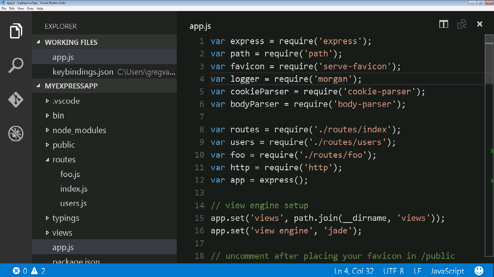
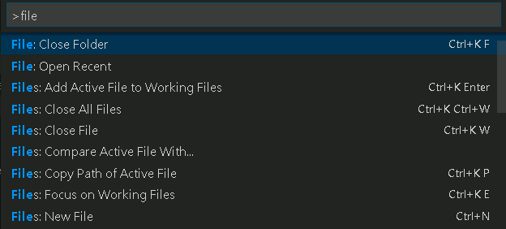

# Accessibility 易用性

Visual Studio Code has many features to help make the editor accessible to all users. Zoom and High Contrast colors improve editor visibility, keyboard-only navigation allows use without a mouse and the editor has been optimized for screen readers.

Visual Studio Code有很多特性能够帮助用户更容易地实现编辑。缩放和高对比度色彩提升了编辑器的可视性，纯键盘导航能够让用户无需使用鼠标，同时编辑器也已经优化了屏幕阅读器。

## Zoom 缩放

You can increase the Zoom level in VS Code with the **View** > **Zoom In** command (`ctrl+=`).  The zoom level increases by 20% each time the command is executed. The **View** > **Zoom Out** (`Ctrl+-`) command lets you decrease the Zoom level.

你可以在VS Code中的**View** > **Zoom In** 命令(`ctrl+=`)增大缩放比例。每次执行该命令，缩放比例都会增大20%。而命令**View** > **Zoom Out** (`Ctrl+-`)则减小缩放比例。

## Persisted Zoom Level 保持缩放比例

With the  `window.zoomLevel` [setting](/md/定制化/用户和工作空间.md), you to change and persist the zoom level of the window. The default value is 0 and each increment increases the zoom level by 20% similar to the effect of the **View** > **Zoom in** command.

通过`window.zoomLevel` [setting](/md/定制化/用户和工作空间.md), 你可以改变和保持窗口的缩放比例。默认值为0，每一次增值都增大20%的缩放比例，类似于**View** > **Zoom in**命令的作用。

## High Contrast Theme 高对比度主题

We support a High Contrast color theme on all platforms.  Use **File** > **Preferences** > **Color Theme** to display the **Select Color Theme** dropdown and select the **High Contrast** theme.

我们支持在所有平台中的高对比度色彩主题。使用**File** > **Preferences** > **Color Theme**来显示**Select Color Theme**下拉框并选择**High Contrast**主题。

## Keyboard Navigation 键盘导航

You will find that VS Code provides an exhaustive list of commands in the **Command Palette** (`Ctrl+Shift+P or F1`) so that you can run VS Code without using the mouse.  Press `Ctrl+Shift+P or F1` then type a command name (e.g. 'git') to filter the list of commands.

VS Code在**Command Palette** (`Ctrl+Shift+P or F1`)中提供了一个全面的命令列表，这样你在使用VS Code的过程中就无需使用鼠标。按下`Ctrl+Shift+P or F1` ，然后输入一个名为(e.g. 'git')的命令来筛选命令列表。

VS Code also has many preset keyboard shortcuts for commands. These are displayed to the right of the command in the **Command Palette**.

VS Code同时也可以通过许多预先设置的键盘快捷键来执行命令。这些快捷键展示的是**Command Palette**中已被授权的命令。

You can also set your own keyboard shortcuts. **File** > **Preferences** > **Keyboard Shortcuts** brings up the **Default Keyboard Shortcuts** in the left pane and your customizable `keybindings.json` on the right.  See [Key Bindings](/md/定制化/快捷键绑定.md) for more details on customizing or adding your own keyboard shortcuts.

你也可以设置自己的键盘快捷键。通过**File** > **Preferences** > **Keyboard Shortcuts**会在左边窗口打开**Default Keyboard Shortcuts**，右边窗口`keybindings.json`则是你的个性化设置。从[Key Bindings](/md/定制化/快捷键绑定.md)中可以看到更多关于个性化和个人键盘快捷键设置的细节。

## Tab Navigation 标签导航

You can use the `Tab` key to jump between VS Code UI controls. Use `Shift+Tab` to tab in reverse order.  As you tab through the UI controls, you can see an indicator around the UI element once the element gains focus.

你可以使用`Tab`键在VS Code的界面控件中切换。使用`Shift+Tab` 可以在相反的顺序切换。当你在界面控件中切换时，你所选中的某个界面元素会出现指示。

Some areas that support Tab navigation are:

* The View switcher (Files, Search, Git, Debug)
* The header of collapsible sections in a view to expand/collapse
* Actions in views and sections
* Actions for items in the tree

支持标签导航的领域有：

* 视图选择（文件，搜索，Git，调试）
* 可折叠部分的标题的视图扩展／折叠
* 对视图和章节的动作
* 对树中项目的动作

## Tab trapping 标签锁定

By default, pressing the `Tab` within a source code file inserts the Tab character (or spaces depending on your Indentation setting) and does not leave the open file. You can toggle the trapping of `Tab` with `Ctrl+M` and subsequent `Tab` keys will move focus out of the file.  When default `Tab` trapping is off, you will see an indicator in the Status Bar.

默认设置中，在插入了标签特性的源代码文件中（或者是取决于你的缩进设置的空间中）按下`Tab`键不会离开正在打开的文件。你可以切换锁定的`Tab`和`Ctrl+M)`，接着用`Tab`键可以取消选中当前的文件。当默认的`Tab`锁定解除，你可以在状态栏中看到相应指示。

Read-only files never trap the `Tab` key.

只读文件不能锁定`Tab`键。

## Screen Readers 屏幕阅读器

VS Code supports screen readers in the editor using a strategy based on paging the text. We have tested using the [NVDA screen reader](http://www.nvaccess.org), but we expect all screen readers to benefit from this suppport.

VS Code支持屏幕阅读器在编辑器中使用基于文档页码的策略。我们已经使用[NVDA screen reader](http://www.nvaccess.org)进行过测试，但是我们希望所有的屏幕阅读器都能从这种支持中受益。

The **Go to Next/Previous Error or Warning** actions (`F8` and `Shift+F8`) allow screen readers to announce the error or warning messages.

**Go to Next/Previous Error or Warning** 动作
(`F8` and `Shift+F8`)允许屏幕阅读器通报错误或者警告信息。

When the suggestions pop up, they will get announced to screen readers. It is possible to navigate the suggestions using `Alt+Up` and `Alt+Down`, you can dismiss the suggestions with `Shift+Escape` and if suggestions get in your way, you can disable the auto-popup of suggestions with the `editor.quickSuggestions` setting.

当建议突然弹出来时，屏幕阅读器会通报给他们。你可以使用`Alt+Up`和`Shift+Escape`来导航该建议，以及使用`Shift+Escape`解除建议。如果弹出的建议让你觉得困扰，你可以用`editor.quickSuggestions`来禁用自动弹出建议的功能。

## Debugger Accessibility 调试器的可访问性

The VS Code debugger UI is user accessible and has the following feature:

* Changes in debug state are read out (e.g. 'started', 'breakpoint hit', 'terminated', ...).
* All debug actions are keyboard accessible.
* Both the Debug View and Debug Console support Tab navigation.
* Debug hover is keyboard accessible (`Ctrl+K Ctrl+I`).

用户可以访问VS Code的调试器界面，且具有以下特性：

* 读出调试模式的改变 (e.g. 'started', 'breakpoint hit', 'terminated', ...).
* 所有的调试动作都可以用键盘访问 
* 调试视图和调试控制都支持标签导航；
* 调试循环支持键盘访问(`Ctrl+K Ctrl+I`).

## Current Known Issues 现行问题

VS Code has some known accessibility issues depending on the platform.

VS Code在不同平台上有一些已知的问题。

### Windows

You can not use the key board (right, left arrow keys) to move between top-level menu items (**File**, **Edit**, **View**, etc).  This is due to Election shell issue [#2504](https://github.com/atom/electron/issues/2504).

不可以使用键盘（右，左方向键）来移动顶层的菜单项(**File**, **Edit**, **View**, etc). 这主要是因为选择Shell脚本的问题[#2504](https://github.com/atom/electron/issues/2504).

### OS X

There is no screen reader support for the editor.

该平台上没有支持本编辑器的屏幕阅读器。

## Next Steps 下一步

Read on to find out about:

* [Visual Studio Code Basics](/md/编辑器/基础.md) - a quick orientation of VS Code
* [Editing Evolved](/md/编辑器/与时俱进的编辑体验.md) - from code colorization & multi-cursor to IntelliSense

阅读更多资料：

* [Visual Studio Code Basics](/md/编辑器/基础.md)- VS Code的快速定向
* [Editing Evolved](/md/编辑器/与时俱进的编辑体验.md)- 从代码色彩化&多程光标到智能感知

## Common Questions 常见问题