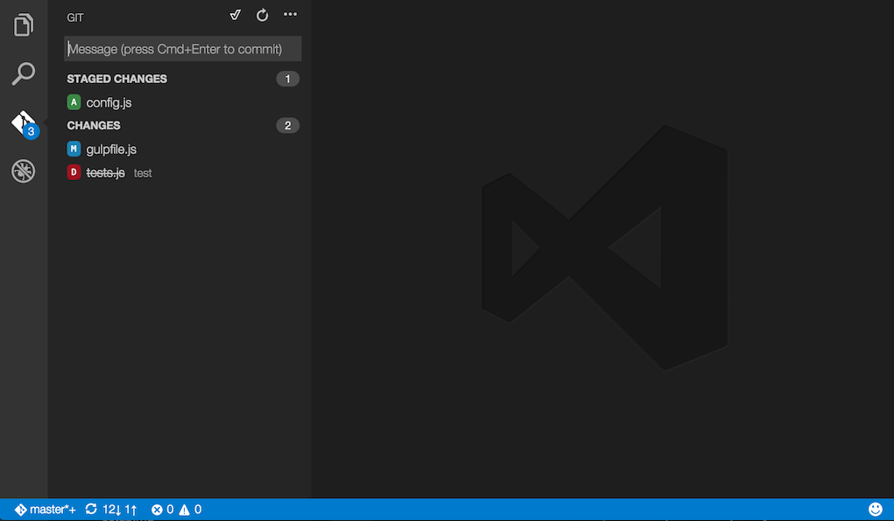
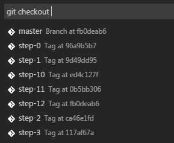
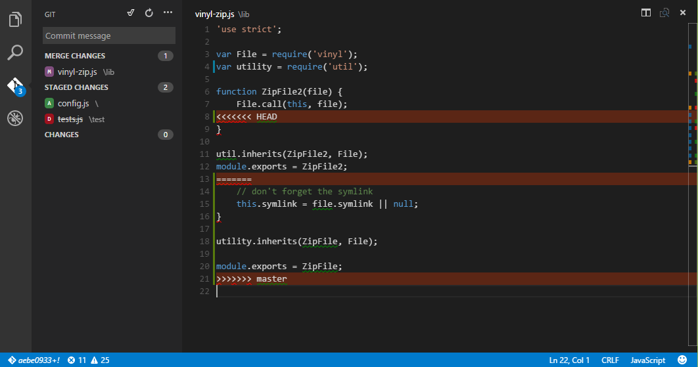
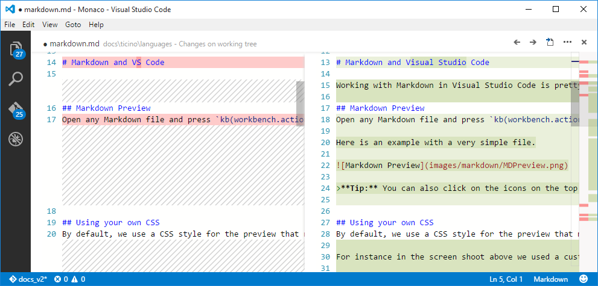
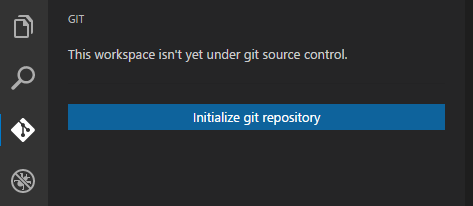
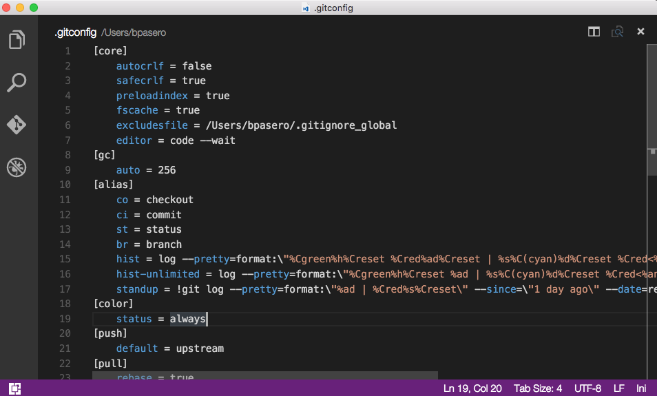

# 版本控制(Version Control)

Visual Studio Code has integrated [Git](http://git-scm.com/) support for the most common commands. This makes it an excellent choice to manage your code commits while you develop.

VS Code 已经集成了 [Git](http://git-scm.com/) 并支持 [Git](http://git-scm.com/) 的大部分常用命令，这使得它是你在开发过程中，管理你的代码并提交的良好选择。

>**Note:** VS Code will leverage your machine's Git installation, so you need to [install Git](http://git-scm.com/download) first before you get these features. Make sure you install at least version `2.0.0`.

>**注意：** VS Code 依赖您的机器上的 Git，因此你需要先[安装 Git](http://git-scm.com/download)，然后才能获得这些功能。确保你安装了 Git 2.0.0以上的版本。

>**Tip:** VS Code will work with any Git repository.  If you don't already have a private hosted Git provider, [Visual Studio Team Services](https://www.visualstudio.com/products/visual-studio-team-services-vs) is a great free option. [Click here to sign-up](https://go.microsoft.com/fwlink/?LinkID=307137&campaign=o~msft~code~vc).

>**提示：** VS Code 可适用于任何 Git 仓库。如果您还没有私人托管的 Git 仓库，[Visual Studio Team Services](https://www.visualstudio.com/products/visual-studio-team-services-vs)是一个免费、不错的选择。[点击这里注册](https://go.microsoft.com/fwlink/?LinkID=307137&campaign=o~msft~code~vc)。

## 概述(Overview)



The Git icon on the left will always indicate an **overview of how many changes** you currently have in your repository. Clicking it will show you the details of your current repository changes: **unstaged**, **staged** and **unresolved conflicting merge** changes.

左侧的 Git 图标将**始终指示您当前在仓库中有多少的更改**。单击它将显示当前仓库更改的详细信息：**未暂存**，**暂存**和**未解决的冲突合并更改**。

Clicking each item will show you in detail **the textual changes within each file**. Note that for unstaged changes, the editor on the right still lets you edit the file: feel free to use it!

单击每个文件将详细显示**每个文件中的文本更改**。注意，对于未暂存的更改，右侧的编辑器仍然允许您编辑文件：使用时放轻松！

You can also find indicators of the **status of your repository** in the bottom left corner of VS Code: the **current branch**, **dirty indicators** and the number of **incoming and outgoing commits** of the current branch. You can **checkout** any branch in your repository by clicking that status indicator and selecting the Git reference from the list.

您还可以在 VS Code 的左下角找到**仓库的状态栏**：**当前分支**，**dirty indicators**以及**当前分支的Git Pull和Git Push提交数**。您可以通过**单击该状态栏**并从列表中选择 Git 引用来切换到仓库中的任何分支。

> **Tip:** You can open VS Code in a sub-directory of a Git repository. VS Code's Git services will still work as usual, showing all changes within the repository, but file changes outside of the scoped directory are shaded with a tool tip indicating they are located outside the current workspace.

> **提示：** 您可以在 Git 仓库的子目录中打开 VS Code。 VS Code 的 Git 服务仍将照常工作，显示仓库中的所有更改，但在范围目录以外的文件更改用一个工具提示，来表示它们位于当前工作区之外。

## Git 状态栏操作(Git Status Bar Actions)

There is a **Synchronize** action in the Status Bar, next to the branch indicator, when the current checked out branch has an upstream branch configured.

如果当前切换到的分支配置了上游分支时，在 Git 状态栏中，在分支指示符旁边有一个**同步操作**。


If there is no upstream branch configured and the Git repository has remotes set up, the **Publish** action is enabled. This will let you publish the current branch to a remote.

如果没有配置上游分支并且 Git 仓库已配置远程仓库，那么将启用 PUSH 操作。这将允许您将当前分支 PUSH 到远程。


## 提交(Commit)

**Staging** and **unstaging** can be done via contextual actions in the files or by drag-and-drop.

**分段**和**拆分**可以通过文件中的上下文操作或通过拖放来完成。

You can type a commit message above the changes and press `kbstyle(Ctrl+Enter)` (Mac: `kbstyle(⌘+Enter)`) to commit them. If there are any staged changes, only those will be committed, otherwise all changes will be committed.

您可以在更改上方输入Commit Message，然后按`kbstyle（Ctrl + Enter）` `（Mac：kbstyle（⌘+ Enter））`提交它们。如果有任何分阶段的更改，只有那些添加提交的将被提交，否则所有更改都将提交。

We've found this to be a great workflow. For example, in the previous screenshot, only the `config.js` file will be included in the commit. A consecutive commit action would commit both `vinyl-zip.js` and `tests.js` in a separate commit.

我们发现这是一个伟大的工作流。例如，在上一个屏幕截图中，只有 config.js 文件被包含在 commit 中。连续的提交操作将提交 vinyl-zip.js 和 tests.js。

More specific **commit actions** can be found in the `...` menu on the top of the Git view.

更具体的 **commit操作** 可以在 Git 视图顶部的`...`菜单中找到。

## 分支和标签(Branches and Tags)

You can create and checkout branches directly within VS code through **Quick Open**. Press `kb(workbench.action.quickOpen)`, type `git` and then press `Space`. You should see the following:

你可以通过**快速打开**，在 VS Code 内直接创建和切换分支。按`kb（workbench.action.quickOpen）`，键入 `git` ，然后按 `空格键` 。您应该看到以下内容：


If you type `checkout` and press `kbstyle(Space)` again, you will see a dropdown containing all of the branches or tags in the current repository.

如果您键入`checkout`并再次按`kbstyle(Space)`，您将看到一个下拉列表，其中包含当前仓库中的所有分支或标记，如下图：



The `git branch` command lets you quickly create a new branch.  Just provide the name of your new branch and VS Code will create the branch and switch to it.

使用`git branch`命令可以快速创建一个新的分支。你只需提供新分支的名称，VS Code 将创建分支并切换到它。

## Remotes

Given that your repository is connected to some remote and that your checked out branch has an [upstream link](http://git-scm.com/book/ch3-5.html) to a branch in that remote, VS Code offers you useful actions to **push**, **pull** and **sync** that branch (the latter will run a **pull** command followed by a **push** command). You can find these actions in the `...` menu.

鉴于您的仓库可能连接到远程，并且您的当前分支有一个[上游分支](http://git-scm.com/book/ch3-5.html)，链接到该远程分支，VS Code 提供了方便的集成操作，**push**, **pull** 和 **同步**该分支（后者将运行一个PULL命令，然后PUSH）。您可以在`...`菜单中找到这些操作。

>**Tip:** You should [set up a credential helper](https://help.github.com/articles/caching-your-github-password-in-git/) to avoid getting asked for credentials every time VS Code talks to your Git remotes.  If you don't do this, you may want to consider disabling automatic fetching via the `git.autofetch` [setting](/md/定制化/用户和工作空间.md) to reduce the number of prompts you get.

>**提示：** 您应该设置一个[credential helper](https://help.github.com/articles/caching-your-github-password-in-git/)，以避免每次VS Code 与您的 Git 远程仓库连接时要求输入凭据。如果不这样做，您可能需要考虑通过 `git.autofetch` 设置禁用自动提取，以减少您收到的提示数。

## 合并冲突(Merge Conflicts)



Merge conflicts are recognized by VS Code; we try to provide useful coloring markers to help you with resolving them. Once resolved, stage the conflicting file so you can commit those changes.

冲突的合并由 VS Code 识别;我们尝试提供有用的着色标记，以帮助您解决它们。一旦解决，突出冲突的文件，以便您可以提交这些更改。

## 查看差异(Viewing Diffs)

Our Git tooling supports viewing of diffs within VS Code.

我们的 Git 工具支持在VS Code中查看差异。



>**Tip:** You can diff any two files by first right clicking on a file in the **WORKING FILES** list and selecting **Select for Compare** and then right-click on the second file to compare with and select **Compare with 'file_name_you_chose'**.   Alternatively from the keyboard hit `kb(workbench.action.showCommands)` and select **File: Compare Active File With...** and you will be presented with a list of recent files.

>**提示：** 首先右键单击**WORKING FILES**列表中的文件并选择选择进行比较，然后右键单击**要比较的第二个文件**，然后选择与`'file_name_you_chose'`比较，即可对任何两个文件进行diff。或者从键盘按下`kb（workbench.action.showCommands）`并选择文件：`比较活动文件与其他`，您将看到一个最近的文件的列表。

## Git输出(Git Output Window)

You can always peek under the hood to see the Git commands we are using.  This is helpful if something strange is happening or if you simply get curious. :)

你可以随时从 Git 输出窗口中看到我们使用的 Git 命令。如果有错误发生时它是非常有用的，或者如果你只是好奇。 :)

To open the Git output window, run **View** > **Toggle Output** and select `Git` from the dropdown.

要打开Git输出窗口，请运行**View> Toggle Output**，然后从下拉列表中选择 `Git`。

## 初始化仓库(Initialize a Repository)

If your workspace isn't under Git source control, you can easily create a Git repository with the **Initialise git repository** command.  When VS Code doesn't detect an existing Git repository, you will see a **This workspace isn't yet under git source control.** message in the Git View and the **Initialize git repository** command will be available.

如果您的工作空间未初始化 Git 仓库，您可以使用`Initialise git repository`命令轻松创建Git仓库。当 VS Code 没有检测到当前目录存在 Git 仓库时，您将看到一个`此工作空间尚未初始化 Git 仓库`。消息在`Git视图`和`初始化git仓库`命令将可用。



Running **Initialize git repository** will create the necessary Git repository metadata files and show your workspace files as unstaged changes.

运行**初始化git仓库**将创建必要的Git仓库元数据文件，并将您的工作空间文件显示为未暂存的更改。

## Git patch/diff 模式(Git patch/diff mode)

When you run VS Code from the command line, you can pass the `--wait` argument to make the command wait until you have closed the current VS Code instance. This can be used to configure VS Code as your Git external editor.

当从命令行运行VS Code时，您可以传递 `--wait`参数，使命令等待，直到您关闭当前 VS Code窗口。这可以用来配置 VS Code 作为你的 Git 外部编辑器。

Here are the steps to do so:

1. Make sure you can run `code --help` from the command line and you get help.
    * if you do not see help, please follow these steps:
        * Mac: Select **Shell Command: Install 'Code' command in path** from the **Command Palette**.
        * Windows: Make sure you selected **Add to PATH** during the installation.
        * Linux: Make sure you installed Code via our new .deb or .rpm packages.
2. From the command line, run `git config --global core.editor "code --wait"`

下面是这样做的一些建议：

1. 确保你可以从命令行运行 `code --help` 命令，并能得到帮助。
    * 如果你没有看见帮助，尝试以下操作：
        * Mac：选择 **Shell命令：在命令面板的路径中安装'code'命令**。
        * Windows：确保你安装时添加了环境变量到 `PATH`。
        * Linux：确保您通过我们的新的.deb或.rpm软件包安装了VS Code。
2. 从命令行，运行 `git config --global core.editor“code --wait”`

Now you can run `git config --global -e` and use VS Code as editor for configuring Git.

现在，您可以运行 `git config --global -e` 并使用 VS Code 作为编辑器来配置 Git。



Add the following to your Git configurations to use VS Code as the diff tool:

将以下内容添加到您的 Git 配置中，以使用VS Code作为比较差异的工具：

```bash
[diff]
    tool = default-difftool
[difftool "default-difftool"]
    cmd = code --wait --diff $LOCAL $REMOTE
```

This leverages the `--diff` option you can pass to VS Code to compare 2 files side by side.

这利用 `--diff` 选项，可以传递到VS Code，以并排比较2个文件。

To summarize, here are some examples of where you can use VS Code as the editor:

总而言之，下面是一些可以使用VS Code作为编辑器的示例：

* `git rebase HEAD~3 -i` do interactive rebase using VS Code
* `git commit` use VS Code for the commit message
* `git add -p` followed by `kbstyle(e)` for interactive add
* `git difftool <commit>^ <commit>` use VS Code as the diff editor for changes

* `git rebase HEAD~3 -i` do interactive rebase using VS Code
* `git commit` use VS Code for the commit message
* `git add -p` followed by `kbstyle(e)` for interactive add
* `git difftool <commit>^ <commit>` use VS Code as the diff editor for changes

## 下一步(Next Steps)

* [Editing Evolved](/md/编辑器/与时俱进的编辑体验.md) - Lint, IntelliSense, Lightbulbs, Peek and Goto Definition and more
* [Debugging](/md/编辑器/调试.md) - This is where VS Code really shines
* [Tasks](/md/编辑器/任务.md) - Running tasks with Gulp, Grunt and Jake.  Showing Errors and Warnings
* [Customization](/md/定制化/概述.md) - Themes, settings and keyboard bindings

## 常见问题(Common Questions)

**Q: Hey, I initialized my repo but the actions in the `...` menu are all grayed out. What gives?**

**A:** To **push, pull and sync** you need to have a Git origin set up.  You can get the required URL from the repo host.  Once you have that URL, you simply need to add it to the Git settings by running a couple of command line actions. For example, for Visual Studio Team Services:

```
> git remote add origin https://<AccountName>.visualstudio.com/DefaultCollection/_git/<RepoName>
> git push -u origin master
```

**Q: My team is using Team Foundation version control (TFVC) instead of Git. What should I do?**

**A:** Use the Team Foundation command line tools.

* For cross-platform use: [Cross-Platform Command-Line Client Beginner's Guide](https://msdn.microsoft.com/en-us/library/hh873092.aspx)
* For Windows: [Use Team Foundation version control commands](https://msdn.microsoft.com/en-us/library/vstudio/cc31bk2e.aspx)

**Q: Why do the Pull, Push and Sync actions never finish?**

This usually means there is no credential management configured in Git and you're not getting credential prompts for some reason.

You can always set up a [credential helper](https://help.github.com/articles/caching-your-github-password-in-git/) in order to pull and push from a remote server without having VS Code prompt for your credentials each time.

**Q: How can I sign into Git with my Team Services account which requires multi-factor authentication?**

**A:** There are now [Git credential helpers](http://blogs.msdn.com/b/visualstudioalm/archive/2015/11/18/visual-studio-team-services-git-credential-manager-for-mac-and-linux.aspx) that assist with multi-factor authentication. You can download these from [Git Credential Manager for Mac and Linux](https://github.com/Microsoft/Git-Credential-Manager-for-Mac-and-Linux) and [Git Credential Manager for Windows](https://github.com/Microsoft/Git-Credential-Manager-for-Windows).

**Q: Using Visual Studio Code, I accidentally initialized a Git repo on a folder with a massive number of files, like my entire hard drive. Now VS Code is too slow to use or hangs. What do I do?**

**A:** First, to get VS Code running again, exit VS Code, then open a command prompt and run

```bash
code -n
```

which opens VS Code in a new window.

Next, assuming you want to remove the unintended repo initialization, look for the `.git` sub-folder in the large folder where you unintentionally initialized the repo, and then delete it. Note that `.git` is a hidden folder, so you might need to show hidden folders to see it. For example, at a command prompt in Windows you can run `dir .git /ah` to see hidden folders named `.git` in a specific folder. If you are not sure where you created the initial folder, run `dir .git /ah /s` at the root folder to see hidden `.git` folders, including sub-folders.

**Q: I have GitHub Desktop installed on my computer but VS Code ignores it.**

**A:** VS Code expects `git.exe` to be on the operating system's `PATH` (`$PATH` on OS X or Linux).  **GitHub Desktop** installs isolated git binaries and does not automatically add `git.exe` to `PATH`.

You can either:

* Add the location of `git.exe` to `PATH` and restart VS Code.
* Set the `git.path` [setting](/md/定制化/用户和工作空间.md) to the location of `git.exe`.

On a **GitHub Desktop** Windows installation, `git.exe` is usually under `C:\Users\USERNAME\AppData\Local\GitHub\PortableGit_COMMITID\ming32\bin`.  Searching for `git.exe` under AppData\Local\GitHub should find the binary.

You can also install Git from [git-scm](http://git-scm.com/) and this will not interfere with **GitHub Desktop**.