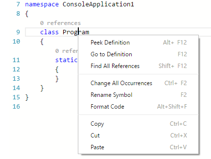
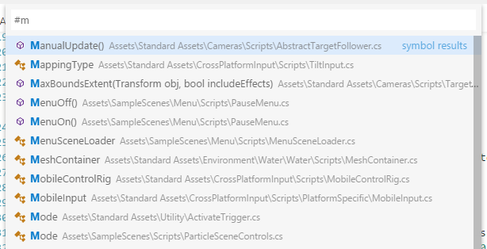
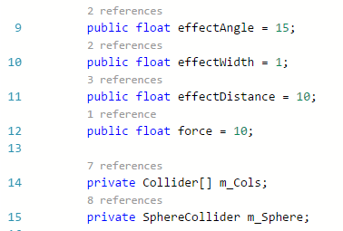
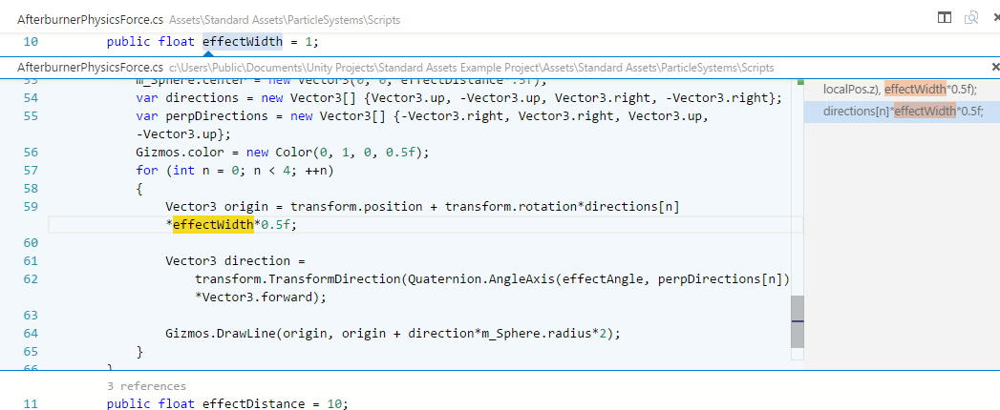

# 用C#进行工作 Working with C&#35;

在VS Code中对C#的支持是针对.NET跨平台开发框架的（DNX）（见“用APS.NET Core和VS Code工作”这篇相关文章）。我们致力于将VS Code作为一个优秀的跨平台C#开发的编辑器。例如让很多Unity游戏开发的厂家乐于使用VS Code来代替MonoDevelop IDE。

The C# support in VS Code is optimized for cross-platform .NET development (DNX) (see [working with ASP.NET Core and VS Code](/md/运行时/ASPnet5.md) for another relevant article).  Our focus with VS Code is to be a great editor for cross-platform C# development.  For instance, many Unity game developers enjoy using VS Code in place of the MonoDevelop IDE.

VS Code支持使用Mono进行C#应用跨平台开发调试的功能。(详见 [Mono Debugging](/md/编辑器/调试.md#mono-debugging))。

We support debugging of C# apps cross-platform via Mono (see [Mono Debugging](/md/编辑器/调试.md#mono-debugging)).

但是因此很多标准的C#工程不能被VS Code所识别。比如ASP.NET MVC应用就是无法识别的一种。在这种情况下如果你只是单纯的想用一个轻量级工具来编辑文件，那么VS Code够用了。如果你对这些项目想有尽可能好的体验，并且通常基于Windows系统开发，我们推荐你还是用[Visual Studio社区版（Community）](https://www.visualstudio.com/products/visual-studio-community-vs).

Due to this focus many standard C# project types are not recognized by VS Code.  An example of a non-supported project type is an ASP.NET MVC Application.  In these cases if you simply want to have a lightweight tool to edit a file - VS Code has you covered.  If you want the best possible experience for those projects and development on Windows in general, we recommend you use [Visual Studio Community](https://www.visualstudio.com/products/visual-studio-community-vs).


## 安装对C#的支持Installing C&#35; support

C#的支持是可选的[（点此从Marketplace安装）](https://marketplace.visualstudio.com/items?itemName=ms-vscode.csharp)。也可通过VS Code里的命令面板输入 **（拓展：安装拓展）Extensions: Install Extension**来搜索“C#”（或者按F1并输入‘ext install’）并在下拉菜单里选择。如果你已经有了一个C#的项目，VS Code也会在你打开一个C#文件不久后提示你安装拓展。

C# language support is an optional [install from the Marketplace](https://marketplace.visualstudio.com/items?itemName=ms-vscode.csharp). You can install it from within VS Code by searching for 'C#' in the **Extensions: Install Extension** dropdown (`kb(workbench.action.showCommands)` and type `ext install`) or if you already have a project with C# files, VS Code will prompt you to install the extension as soon as you open a C# file.

## Roslyn and OmniSharp（前者是C&#35;的编译器，后者是对C&#35;的自动补全及智能提示。）

VS Code通过使用 [Roslyn](https://github.com/dotnet/roslyn) 和 [OmniSharp](http://www.omnisharp.net) 来提供更好的C#体验。我们支持以下两种项目。

- DNX环境下的工程（DNX projects）
- MS解决方案下的工程（MSBuild projects）


Visual Studio Code uses the power of [Roslyn](https://github.com/dotnet/roslyn) and [OmniSharp](http://www.omnisharp.net) to offer an enhanced C# experience.  We offer support for both:

- DNX projects
- MSBuild projects

在启动最佳匹配项目时，可自动加载，但也可以手动选择项目。状态栏将会显示已经加载了什么项目。并且也允许你选择不同的项目。只需要你点击状态栏项目图标并选择更换项目。下图显示有一个项目已经被打开。

On startup the best matching projects are loaded automatically but you can also choose your projects manually.  The status bar will show what projects have been loaded and also allows you to select a different set of projects. To do so, click on the status bar projects item and select *Change projects…*.  In the image below a single project has been picked up:


可选项包括：

* 选择一个 ```project.json``` 文件，将会打开一个DNX项目并且VS Code将会加载与之相关的项目。 will load that project plus the referenced projects.
* 选择一个 ```*.sln``` 文件会打开一个MS解决方案，它会加载有关```*.csproj```的工程以及同级或子代```project.json``` 文件，但是不会打开解决方案中其他工程中的文件。
* 选择一个 ```folder``` 将会使VS Code搜索 ```*.sln``` 以及 ```project.json``` 文件并且VS Code将会尝试将它们全部加载。

Once the project is loaded the enhanced experiences light up...

The available options include:

* Select a```project.json``` file will open a DNX-project and VS Code will load that project plus the referenced projects.
* Select a ```*.sln``` file opens a MSBuild-project. It will load the referenced ```*.csproj``` projects and sibling or descendant ```project.json``` files but no other project files that are referenced from the solution file.
* Select a ```folder``` will make VS Code scan for ```*.sln``` and ```project.json``` files and VS Code will attempt to load them all.

Once the project is loaded the enhanced experiences light up...

## C#的编辑特性Editing Evolved

你会有许多关于C#和编辑器的发现，例如代码格式，智能提示，代码重构等等。

如果想知道全部对于VS Code在代码编辑时的特点，请戳[Editing Evolved](/md/编辑器/与时俱进的编辑体验.md)这篇文章。

接下来列出一些亮点...

There is a lot to discover with C# and the editor, such as format on type, IntelliSense, the rename-refactoring, etc.



For a full description of our editing features go to the [Editing Evolved](/md/编辑器/与时俱进的编辑体验.md) documentation.

Here are a few highlights...

## 智能感知IntelliSense

只有在你按下 `kb(editor.action.triggerSuggest)` 的时候才会得到语境下的具体建议。

IntelliSense just works hit `kb(editor.action.triggerSuggest)` at any time to get context specific suggestions.


## C#的代码片段Snippets for C&#35;

在VS Code里内置了几种代码片段，在你输入或者按 `kb(editor.action.triggerSuggest)` （触发建议）并且VS Code会给你一个基于语镜的建议列表。

**提示:** 你可以添加C#的自定义代码片段，详见 [自定义代码片段](/md/定制化/用户定义代码段.md) 。

We have several built-in snippets included in VS Code that will come up as you type or you can press `kb(editor.action.triggerSuggest)` (Trigger Suggest) and we will give you a context specific list of suggestions.


>**Tip:** You can add in your own User Defined Snippets for C#.  Take a look at [User Defined Snippets](/md/定制化/用户定义代码段.md) to find out how.

## 代码追踪 Search for Symbols

VS Code同样有一些超出编辑器的特点。其中一个能力就是代码追踪。按 `kb(workbench.action.showAllSymbols)` 并开始输入，你将会看到一个相关列表。选择你想要的一项，你就会被带到它的具体位置。

There are also features outside the editor. One is the ability to search for symbols from wherever you are. Hit `kb(workbench.action.showAllSymbols)`, start typing, and see a list of matching C# symbols. Select one and you’ll be taken straight to its code location.



## CodeLens

另外一个很酷的特性就是能看到方法的引用次数。通过点击定义会在Peek视图看到引用信息。

>**Note:** 由于性能原因，只有在对象中定义的方法才会被计入。例如 `equals` and `hashCode` 将不会得到引用信息。

**提示:** 你可以通过 `editor.referenceInfos` 关闭引用次数提示，详见 [setting](/md/定制化/用户和工作空间.md) 

Another cool feature is the ability to see the number of references to a method directly above the method. Click on the reference info to see the references in the Peek view.  This reference information updates as you type.

>**Note:** Methods defined in `object`, such as `equals` and `hashCode` do not get reference information due to performance reasons.



>**Tip:** You can turn off references information with the `editor.referenceInfos` [setting](/md/定制化/用户和工作空间.md).

## 查找引用/速览定义 Find References/Peek Definition

你可以通过点击一个对象的定义来找到它的使用地点而不必离开当前语境。反过来你也可以在行间查看对象的定义。

You can click on the references of an object to find the locations of its use in place without losing context.  This same experience works in reverse where you can Peek the definition of an object and see it inline without leaving your location.



## 快速修复/建议 Quick Fixes / Suggestions

在VS Code里提供一些基础的快速修复功能。你会看到一个小灯泡然后点击它，或者按 `kb(editor.action.quickFix)` 提供一个简单列表提供修复或者修复意见。

There are some basic quick fixes supported in VS Code.  You will see a lightbulb and clicking on it, or pressing `kb(editor.action.quickFix)` provides you with a simple list of fixes/suggestions.


## 接下来 Next Steps

看看关于：

* [ASP.NET Core开发](/md/运行时/ASPnet5.md) - 如何安排并采用跨平台框架.NET
* [编辑特性（Editing Evolved）](/md/编辑器/与时俱进的编辑体验.md) - 看看更多优秀的编辑特性。
* [Tasks](/md/编辑器/任务.md) - use tasks to build your project and more
* [调试相关（Debugging）](/md/编辑器/调试.md) - 看看如何在你的工程里使用调试功能。

Read on to find out about:

* [ASP.NET Core Development](/md/运行时/ASPnet5.md) - get up and running with cross-platform .NET
* [Editing Evolved](/md/编辑器/与时俱进的编辑体验.md) - find out more about advanced editing features
* [Tasks](/md/编辑器/任务.md) - use tasks to build your project and more
* [Debugging](/md/编辑器/调试.md) - find out how to use the debugger with your project

## 常见问题 Common Questions

**Q: 为啥我的项目无法加载。**

**A:** VS Code只支持有限的工程种类（主要是ASP.NET Core）。如果想要对.NET平台所有种类工程的支持,还是推荐你使用 [Visual Studio社区版（Community）](https://www.visualstudio.com/products/visual-studio-community-vs).

**Q: 为啥智能感知不好用。**

**A:** 这通常是因为当前项目的类型不受支持的结果。你可以看看状态栏左下角的OmniSharp的火焰提示。

**Q: 我该怎么建立/运行我的工程？**

**A:** VS Code 支持任务的建立以及对于MSBuild，CSC,XBuild的理解。详情请查阅 [Tasks](/md/编辑器/任务.md) 文档.


**Q: My Project won't load.**

**A:** VS Code only supports a limited set of project types (primarily ASP.NET Core).  For full .NET project support, we suggest you use [Visual Studio Community](https://www.visualstudio.com/products/visual-studio-community-vs).

**Q: IntelliSense is not working.**

**A:** This is typically as a result of the current project type not being supported.  You can see an indication in the OmniSharp flame in the bottom left hand side of the status bar.

**Q: How do I build/run my project?**

**A:** VS Code supports tasks for build and natively understand the output of MSBuild, CSC, XBuild.  Find out more in the [Tasks](/md/编辑器/任务.md) documentation.

