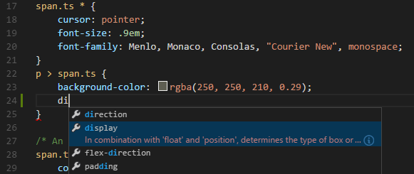
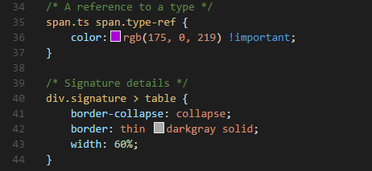
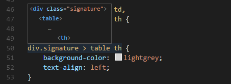

# CSS, Sass and Less

VS Code内置对样式表编辑的支持，对于CSS `.css`, Sass `.scss` 和 Less `.less`。这些支持包括：

Visual Studio Code has built-in support for editing style sheets in CSS `.css`, Sass `.scss` and Less `.less`.  This support includes:

##智能感知 IntelliSense

我们提供对选择器，属性以及值的支持。按 `kb(editor.action.triggerSuggest)` 会得到一个具体列表。

We have support for selectors, properties and values. Use `kb(editor.action.triggerSuggest)` to get a list of context specific options.



建议中包括大量的文档，其中包括一个对浏览器兼容性的建议列表。如果对选中项想看完整描述按 `kb(toggleSuggestionDetails)`（哎哎为什么我的快捷键不好用。。2016-5-14）.

Proposals contain extensive documentation, including a list of browsers that support the property. To see the full description text of the selected entry, use `kb(toggleSuggestionDetails)`.

##Emmet语法 Emmet snippets

按 `kb(editor.emmet.action.expandAbbreviation)` 拓展当前缩写

>**小贴士:** Emmet对CSS的支持详见 [Emmet cheat sheet](http://docs.emmet.io/cheat-sheet).

我们同样支持 [用户定义代码段](/md/定制化/用户定义代码段.md).

Press `kb(editor.emmet.action.expandAbbreviation)` to expand the current abbreviation.

>**Tip:** See the CSS section of the [Emmet cheat sheet](http://docs.emmet.io/cheat-sheet) for valid abbreviations.

We also support [User Defined Snippets](/md/定制化/用户定义代码段.md).

##语法高亮及颜色浏览 Syntax coloring & Color preview

当你编辑CSS样式时，VS Code提供语法高亮以及对你所设置的颜色浏览。

As you type, we provide syntax highlighting as well as in context preview of colors.



##语法验证 Syntax Verification & Linting

该功能对 CSS 版本 <= 2.1, Sass 版本 <= 3.2 and Less 版本 <= 1.7有效。

>**注意:** 你可以在通过在用户定义代码段 [设置](/md/定制化/用户和工作空间.md)来禁用VS Code对于CSS,Sass或者Less的默认语法验证。
>```json
>    "css.validate": false
>```

We support CSS version <= 2.1, Sass version <= 3.2 and Less version <= 1.7.

>**Note:** You can disable VS Code's default CSS, Sass or Less validation by setting the corresponding `.validate` User or Workspace [setting](/md/定制化/用户和工作空间.md) to false.
>```json
>    "css.validate": false
>```

## 转到文件的符号信息 Goto symbol in file

按 `kb(workbench.action.gotoSymbol)`即可。

Simply press `kb(workbench.action.gotoSymbol)`.

## Hovers

鼠标停留在选择器上将会得到一个通过CSS规则匹配的HTML代码片段。

Hovering over a selector or property will provide an HTML snippet that is matched by the CSS rule.



## 声明跳转及引用查找 Goto Declaration and Find References

在同一个文件里支持Sass和Less的变量实现此功能。

>**注意:**对于夸文件的引用 ('imports') 是无效的.

This is supported for Sass and Less variables in the same file.

>**Note:** Cross file references ('imports') are not resolved.

## 将Sass和Less编译成CSS Transpiling Sass and Less into CSS

VS Code可以通过自带的[task runner](/md/编辑器/任务.md)将Sass和Less编译为CSS。我们可以用这个功能将 `.scss` 或者 `.less` 文件编译为 `.css` ，这个功能对一个简单的Sass/Less文件有效。

VS Code can integrate with Sass and Less transpilers through our integrated [task runner](/md/编辑器/任务.md).  We can use this to transpile `.scss` or `.less` files into `.css` files.  Let's walk through transpiling a simple Sass/Less file.

### 第一步：安装一个Sass或者Less的编译器。Step 1: Install a Sass or Less transpiler

对此，可以使用[node-sass](https://www.npmjs.com/package/node-sass) 或者 [less](https://www.npmjs.com/package/less) 这两个Node.js 的模块。

>**注意:** 如果你没有 [Node.js](https://nodejs.org) 以及没有安装 [NPM](https://www.npmjs.com/) 包管理器,你得装。 [在你的系统安装Node.js](https://nodejs.org/en/download/). Node Package Manager (NPM) 会随着Node.js安装.你只要打开一个新的命令行终端输入

```
npm install -g node-sass less
```

For this walkthrough, let's use either the [node-sass](https://www.npmjs.com/package/node-sass) or [less](https://www.npmjs.com/package/less) Node.js module.

>**Note:** If you don't have [Node.js](https://nodejs.org) and the [NPM](https://www.npmjs.com/) package manager already installed, you'll need to do so for this walkthrough. [Install Node.js for your platform](https://nodejs.org/en/download/). The Node Package Manager (NPM) is included in the Node.js distribution. You'll need to open a new terminal (command prompt) for `npm` to be on your PATH.

```
npm install -g node-sass less
```

### 第二步：新建一个简单的Sass或者Less文件。 Step 2: Create a simple Sass or Less file
在VS Code打开一个空的文件夹并且创建 `styles.scss` 或者 `styles.less` 文件.然后把下面的代码放入文件。

（如果是less文件，把`$padding` 改成 `@padding`即可。）

```scss
$padding: 6px;

nav {
  ul {
    margin: 0;
    padding: $padding;
    list-style: none;
  }

  li { display: inline-block; }

  a {
    display: block;
    padding: $padding 12px;
    text-decoration: none;
  }
}
```

>**注意:**这是个非常简单的例子。这就是为什么源代码在两种文件类型中几乎是相同的。


Open VS Code on an empty folder and create a `styles.scss` or `styles.less` file.  Place the following code in that file:

```scss
$padding: 6px;

nav {
  ul {
    margin: 0;
    padding: $padding;
    list-style: none;
  }

  li { display: inline-block; }

  a {
    display: block;
    padding: $padding 12px;
    text-decoration: none;
  }
}
```

For the Less version of the above file, just change `$padding` to `@padding`.

>**Note:** This is a very simple example, which is why the source code is almost identical between both file types.  In more advanced scenarios, the syntaxes and constructs will be much different.

###第三步：创建Create tasks.json Step 3: Create tasks.json

下一步是进行任务配置。按 `kb(workbench.action.showCommands)` 打开**命令面板**。按Enter选择“任务：配置任务运行程序”，在选择对话框中，选择“其他(Others)”。

这将会在工作空间的`.vscode` 文件夹创建一个`tasks.json`示例文件。这个文件包含了一个可以执行任意命令的样例。我们可以简单修改下编译配置。

```json
// Sass configuration
{
    "version": "0.1.0",
    "command": "node-sass",
    "isShellCommand": true,
    "args": ["styles.scss", "styles.css"]
}
```

```json
// Less configuration
{
    "version": "0.1.0",
    "command": "lessc",
    "isShellCommand": true,
    "args": ["styles.less", "styles.css"]
}
```

VS Code将`node-sass` or `lessc`当作一个外部任务处理器：将Sass/Less files编译为CSS文件。我们需要的执行命令就是 `node-sass styles.scss styles.css` 或者 `lessc styles.less styles.css`.

The next step is to set up the task configuration.  To do this open the **Command Palette** with `kb(workbench.action.showCommands)` and type in **Configure Task Runner**, press `kbstyle(Enter)` to select it. In the selection dialog that shows up, select `Others`.

This will create a sample `tasks.json` file in the workspace `.vscode` folder.  The initial version of file has an example to run an arbitrary command. We will simply modify that configuration for transpiling Less/Sass instead:

```json
// Sass configuration
{
    "version": "0.1.0",
    "command": "node-sass",
    "isShellCommand": true,
    "args": ["styles.scss", "styles.css"]
}
```

```json
// Less configuration
{
    "version": "0.1.0",
    "command": "lessc",
    "isShellCommand": true,
    "args": ["styles.less", "styles.css"]
}
```

VS Code interprets `node-sass` or `lessc` as an external task runner exposing exactly one task: the transpiling of Sass/Less files into CSS files. The command we run is `node-sass styles.scss styles.css` or `lessc styles.less styles.css`.

###第四步：编译 Step 4: Run the Build Task

因为这个文件只有这一个任务，你可以直接按 `kb(workbench.action.tasks.build)` (**Run Build Task**)来编译。样例文件不应该出现任何编译问题，所以只会生成相应的 `styles.css` 
As this is the only task in the file, you can execute it by simply pressing `kb(workbench.action.tasks.build)` (**Run Build Task**).  The sample Sass/Less file should not have any compile problems, so by running the task all that happens is a corresponding `styles.css` file is created.

##自动化Sass/Less编译 Automating Sass/Less compilation

你也可以试试往前再走一步——用VS Code进行自动化Sass/Less编译。我们用和以前相同的任务执行（task runner），但是要做些修改。

Let's take things a little further and automate Sass/Less compilation with VS Code.  We can do so with the same task runner integration as before, but with a few modifications.

###第一步：安装Gulp和一些插件。 Step 1: Install Gulp and some plug-ins

我们用[Gulp](http://gulpjs.com/)来创建任务使Sass/Less自动化编译。同样用到[gulp-sass](https://www.npmjs.com/package/gulp-sass) 这个插件。Less的话用 [gulp-less](https://www.npmjs.com/package/gulp-less)这个插件。

先安装 `gulp`(不要用 `-g`)

```
npm install gulp gulp-sass gulp-less
```
> **注意:** `gulp-sass` 和 `gulp-less` 是Gulp对于`node-sass` 和 `lessc`这两个我们以前用过的模块的插件 也有许多其他Gulp的Sass和Less插件可供选择,以及Grunt的插件。


We will use [Gulp](http://gulpjs.com/) to create a task that will automate Sass/Less compilation.  We will also use the [gulp-sass](https://www.npmjs.com/package/gulp-sass) plug-in to make things a little easier.  The Less plug-in is [gulp-less](https://www.npmjs.com/package/gulp-less).

We need to install `gulp` locally (no `-g` switch):

```
npm install gulp gulp-sass gulp-less
```

> **Note:** `gulp-sass` and `gulp-less` are Gulp plug-ins for the `node-sass` and `lessc` modules we were using before.  There are many other Gulp Sass and Less plug-ins you can use, as well as plug-ins for Grunt.

### 第二步：创建个简单的Gulp任务 Step 2: Create a simple Gulp task

在VS Code打开之前的文件夹(包含 `styles.scss`/`styles.less` 和在 `.vscode` 文件夹下的 `tasks.json`)并且在根目录下创建 `gulpfile.js`。然后把下面的代码复制进去。

```javascript
// Sass configuration
var gulp = require('gulp');
var sass = require('gulp-sass');

gulp.task('sass', function() {
    gulp.src('*.scss')
        .pipe(sass())
        .pipe(gulp.dest(function(f) {
            return f.base;
        }))
});

gulp.task('default', ['sass'], function() {
    gulp.watch('*.scss', ['sass']);
})
```

```javascript
// Less configuration
var gulp = require('gulp');
var less = require('gulp-less');

gulp.task('less', function() {
    gulp.src('*.less')
        .pipe(less())
        .pipe(gulp.dest(function(f) {
            return f.base;
        }))
});

gulp.task('default', ['less'], function() {
    gulp.watch('*.less', ['less']);
})
```

这样会发生什么呢？

1. 我们 `default` 的gulp任务在启动时首先运行过去的 `sass` 或者 `less` 任务。
2. 会监听到之后工作空间根目录下任何Sass/Less文件的变化。例如在VS Code打开当前文件夹。（留个坑回来填，这句话好像理解的不对。）
3. 一旦源文件有变动，就会用我们的编译器自动生成编译后的版本。例如 `gulp-sass`, `gulp-less`.
4. We now have a set of CSS files, each named respectively after their original Sass/Less file. We then put these files in the same directory.


Open VS Code on the same folder from before (contains `styles.scss`/`styles.less` and `tasks.json` under the `.vscode` folder), and create `gulpfile.js` at the root.

Place the following code in the `gulpfile.js` file:

```javascript
// Sass configuration
var gulp = require('gulp');
var sass = require('gulp-sass');

gulp.task('sass', function() {
    gulp.src('*.scss')
        .pipe(sass())
        .pipe(gulp.dest(function(f) {
            return f.base;
        }))
});

gulp.task('default', ['sass'], function() {
    gulp.watch('*.scss', ['sass']);
})
```

```javascript
// Less configuration
var gulp = require('gulp');
var less = require('gulp-less');

gulp.task('less', function() {
    gulp.src('*.less')
        .pipe(less())
        .pipe(gulp.dest(function(f) {
            return f.base;
        }))
});

gulp.task('default', ['less'], function() {
    gulp.watch('*.less', ['less']);
})
```

What is happening here?

1. Our `default` gulp task first runs the `sass` or `less` task once when it starts up.
2. It then watches for changes to any Sass/Less file at the root of our workspace, for example the current folder open in VS Code.
3. It takes the set of Sass/Less files that have changed and runs them through our respective compiler, for example `gulp-sass`, `gulp-less`.
4. We now have a set of CSS files, each named respectively after their original Sass/Less file.  We then put these files in the same directory.

### Step 3: Modify the configuration in tasks.json for watching

To complete the tasks integration with VS Code, we will need to modify the task configuration from before, to set a watch on the default Gulp task we just created.  Your tasks configuration should now look like this:

```json
{
    "version": "0.1.0",
    "command": "gulp",
    "isShellCommand": true,
    "tasks": [
        {
            "taskName": "default",
            "isBuildCommand": true,
            "showOutput": "always",
            "isWatching": true
        }
    ]
}
```

### Step 4: Run the Build Task

Again, as this is the only task in the file you can execute it by simply pressing `kb(workbench.action.tasks.build)` (**Run Build Task**).  But this time, we've set a watch so the Status Bar should indicate that on the left-hand side.


At this point, if you create and/or modify other Less/Sass files, you will see the respective CSS files generated and/or changes reflected on save.  You can also enable [Auto Save](/md/编辑器/基础.md#saveauto-save) to make things even more streamlined.

If you want to stop the watch, you can press `kb(workbench.action.tasks.build)` again and click **Terminate Running Task** in the message box. Or you can use the **Command Palette** with `kb(workbench.action.showCommands)` and find the terminate command there.

## Customizing CSS, Sass and Less Settings

You can configure the following lint warnings as [User and Workspace Settings](/md/定制化/用户和工作空间.md).

The `validate` setting allows you turn off the built-in validation. You would do this if you rather use a different linter.

Id|Description|Default
---|------------|----
css.validate | Enables or disables all css validations | true
less.validate | Enables or disables all less validations | true
sass.validate | Enables or disables all sass validations | true

To configure an option for CSS, use `css.lint.` as the prefix to the id; for Sass and Less, use `less.lint.` and `sass.lint.`.

Set a setting to `warning` or `error` if you want to enable lint checking, use `ignore` to disable it. Lint checks are performed as you type.

Id|Description|Default
---|------------|----
validate | Enables or disables all validations | true
compatibleVendorPrefixes | When using a property with a vendor-specific prefix (for example `-webkit-transition`), make sure to also include all other vendor-specific properties eg. `-moz-transition`, `-ms-transition` and `-o-transition` | ignore
vendorPrefix | When using a property with a vendor-specific prefix for example `-webkit-transition`, make sure to also include the standard property if it exists eg. `transition` | warning
duplicateProperties | Warn about duplicate properties in the same ruleset | ignore
emptyRules | Warn about empty rulesets | warning
importStatement | Warn about using an `import` statement as import statements are loaded sequentially which has a negative impact on web page performance | ignore
boxModel | Do not use `width` or `height` when using `padding` or `border` | ignore
universalSelector | Warn when using the universal selector `*` as it is known to be slow and should be avoided | ignore
zeroUnits | Warn when having zero with a unit e.g. `0em` as zero does not need a unit.  | ignore
fontFaceProperties | Warn when using `@font-face` rule without defining a `src` and `font-family` property | warning
hexColorLength | Warn when using hex numbers that don't consist of three or six hex numbers | error
argumentsInColorFunction | Warn when an invalid number of parameters in color functions e.g. `rgb` | error
unknownProperties | Warn when using an unknown property | warning
ieHack | Warn when using an IE hack `*propertyName` or `_propertyName` | ignore
unknownVendorSpecificProperties | Warn when using an unknown vendor-specific property | ignore
propertyIgnoredDueToDisplay | Warn when using a property that is ignored due to the display. For example with `display: inline`, the `width`, `height`, `margin-top`, `margin-bottom`, and `float` properties have no effect. | warning
important | Warn when using `!important` as it is an indication that the specificity of the entire CSS has gotten out of control and needs to be refactored. | ignore
float | Warn when using `float` as floats lead to fragile CSS that is easy to break if one aspect of the layout changes. | ignore
idSelector | Warn when using selectors for an id `#id` as selectors should not contain IDs because these rules are too tightly coupled with the HTML. | ignore

##接下来... Next Steps

看看关于...

Read on to find out about:

* [任务：配置运行程序](/md/编辑器/任务.md) - 深入挖掘这个能帮助你将Sass和Less编译成CSS。
* [提升编辑体验](/md/编辑器/与时俱进的编辑体验.md) -了解编辑器对语言提供的丰富的功能集，正如CSS。
* [HTML](/md/语言/html.md) - 除了CSS，HTML在VS Code中同样被很好的支持。

* [Configure Tasks](/md/编辑器/任务.md) - Dig into Tasks to help you transpile your Sass and Less to CSS.
* [Editing Evolved](/md/编辑器/与时俱进的编辑体验.md) - Find out about the rich set of features the editor offers for languages such as CSS.
* [HTML](/md/语言/html.md) - CSS is just the start, HTML is also very well supported in VS Code.

##常见问题解答 Common Questions

**Q: VS Code提供拾色器吗**

**A:** 不提供。

**Q: VS Code支持基于Sass的缩进语法吗 ?**

**A:** 不支持。


**Q: Do you provide a color selector?**

**A:** No, this is currently not supported.

**Q: Do you support the indentation based Sass syntax (.sass) ?**

**A:** No, not yet.