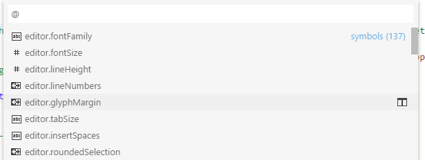

# JSON

JSON is a data format that is common in configuration files like `package.json` or `project.json`. We also use it extensively in VS Code for our configuration files.  When opening a file that ends with `.json`, VS Code provides the following set of features that make it simpler to write or modify the file's content.

JSON是一种数据格式，常见于配置文件如`package.json`或`project.json`。我们在VS Code中也广泛地使用它作为配置文件。当打开与结尾的文件`.json`时，VSCode提供了，能更简单地编写或修改文件内容的功能集。

## JSON 注释 JSON Comments

Comments in JSON are an extension to JSON specification that is supported by VS Code. You can use single line (//) as well as block comments (/* */) as used in JavaScript.

JSON中的JSON是一种JSON规范的扩展，是被VS Code支持的。在使用JavaScript时，使用单行（//）以及块（/* */）注释。

## 智能感知和验证 IntelliSense & Validation

For properties and values (`kb(editor.action.triggerSuggest)`), both for JSON data with and without schema, we offer up suggestions as you type with IntelliSense.   We also perform structural and value verification based on an associated JSON schema giving you red squigglies.

对于属性和值(`kb(editor.action.triggerSuggest)`)，无论JSON数据是否是使用模式(schema)的JSON数据，智能感知在你输入时，都提供建议。基于关联的JSON模式，还进行了结构和值验证并显示红色标记。


### 包及项目依赖 Package and Project Dependencies

We also offer IntelliSense for specific value sets such as package and project dependencies in `package.json`, `project.json` and `bower.json`.

通过`package.json`, `project.json` and `bower.json`，我们还提供智能感知特定值集，如包和项目依赖

## 快速导航 Quick Navigation

JSON files can get pretty large and we support quick navigation to properties `kb(workbench.action.gotoSymbol)` (**Go to Symbol**) with the Command Palette.

JSON文件可以相当大。通过命令面板的(**Go to Symbol**)，我们支持快速导航到属性`kb(workbench.action.gotoSymbol)` 



## 悬浮 Hovers

When you hover over properties and values for JSON data with or without schema, we will provide additional context.

当你将鼠标悬停在JSON数据的属性和值时，我们将提供更多的上下文。无论JSON数据是否有模式（schema）。


## 格式化 Formatting

You can format your JSON document (or just a part of it) using `kb(editor.action.format)` or **Format** from the context menu.

使用`kb(editor.action.format)` 或上下文菜单的**Format**，你能够格式化你的JSON文档。

## JSON模式和设置 JSON Schemas & Settings

To understand the structure of JSON files, we use [JSON schemas](http://spacetelescope.github.io/understanding-json-schema/). JSON schemas describe the shape of the JSON file, as well as value sets, default values, and descriptions.

要了解的 JSON 文件结构，我们使用了 [JSON模式](http://spacetelescope.github.io/understanding-json-schema/)。JSON模式描述了 JSON 文件的构成，以及值集、 默认值和说明。

Servers like [JSON Schema Store](http://schemastore.org) provide schemas for most of the common JSON based configuration files. However, schemas can also be defined in a file in the VS Code workspace, as well as the VS Code settings files.

像 [JSON模式存储](http://schemastore.org) 服务，提供最常见的基于配置文件的JSON模式。尽管如此，模式也可以在VSCode工作区的文件，以及在VS Code设置文件中被定义。

The association of a JSON file to a schema can be done either in the JSON file itself using the `$schema` attribute, or in the User or Workspace [Settings](/md/定制化/用户和工作空间.md) (**File** > **Preferences** > **User Settings** or **Workspace Settings**) under the property `json.schemas`.

一个JSON文件可以关联到一个模式。通过该JSON文件本身使用相应`$schema`属性，或者通过用户或工作区 [设置](/md/定制化/用户和工作空间.md)(**文件** > **首选项** > **用户设置** 或 **工作区设置**)下的属性`json.schemas`。

VS Code extensions can also define schemas and schema mapping. That's why VS Code already knows about the schema of some well known JSON files such as `package.json`, `bower.json` and `tsconfig.json`.

VS Code 扩展也可以定义模式到模式的映射。这就是为什么VS Code已经知道了一些知名的JSON文件，如`package.json`，`bower.json`和`tsconfig.json`的模式。

### 在JSON中映射 Mapping in the JSON

In the following example, the JSON file specifies that its contents follow the [CoffeeLint](http://www.coffeelint.org/) schema.

下面的例子是，指定一个JSON文件的内容遵循[CoffeeLint](http://www.coffeelint.org/) 模式

```json
{
   "$schema": "http://json.schemastore.org/coffeelint",
   "line_endings": "unix"
}
```

### 在用户设置中映射 Mapping in the User Settings

The following excerpt from the User Settings shows how `.babelrc` files are mapped to the [babelrc](https://babeljs.io/docs/usage/babelrc) schema located on http://json.schemastore.org/babelrc.

下面，从用户设置中摘录的内容显示如何将 `.babelrc`文件映射到位于http://json.schemastore.org/babelrc 的 [babelrc](https://babeljs.io/docs/usage/babelrc)的模式。

```json
"json.schemas": [
    {
        "fileMatch": [
            "/.babelrc"
        ],
        "url": "http://json.schemastore.org/babelrc
    },
```

>**Tip:** Additionally to defining a schema for `.babelrc`, also make sure that `.babelrc` is associated to the JSON language mode. This is also done in the settings using the `files.association` array setting.

>**小贴士:** 此外，以定义一个模式`.babelrc`，也要确保`.babelrc`关联到JSON语言。这也可以使用`files.associative`数组设置的设置来完成。

>**Tip:** For an overview on settings, see [User and Workspace Settings](/md/定制化/用户和工作空间.md).

>**小贴士:** 有关设置的概述，参考[用户和工作区设置](/md/定制化/用户和工作空间.md)。

### 在工作区中映射到模式  Mapping to a Schema in the Workspace

To map a schema that is located in the workspace, use a relative path. In this example, a file in the workspace root called `myschema.json` will be used as the schema for all files ending with `.foo.json`.

要映射位于工作区中的模式，请使用相对路径。在这个例子中，位于工作空间中的根的`myschema.json`文件，被用来当作所有`.foo.json`结尾的文件的模式。

```json
"json.schemas": [
    {
        "fileMatch": [
            "/*.foo.json"
        ],
        "url": "./myschema.json"
    },
```

### 在设置中定义映射到模式  Mapping to a Schema Defined in Settindgs

To map a schema that is defined in the User or Workspace Settings, use the `schema` property. In this example, a schema is defined that will be used for all files named `.myconfig`.

要映射在用户或工作区设置中定义一个模式，使用`schema`属性。在这个例子中，定义一个模式用于所有`.myconfig`的文件。

```json
"json.schemas": [
    {
        "fileMatch": [
            "/.myconfig"
        ],
        "schema": {
            "type": "object",
            "properties": {
                "name" : {
                    "type": "string",
                    "description": "The name of the entry"
                }
            }
        }
    },
```


### 在扩展中映射一个模式 Mapping a Schema in an Extension

Schemas and schema associations can also be defined by an extension. Check out the [jsonValidation contribution point](/md/扩展API/扩展点.md#contributesjsonvalidation).

模式和模式关联也可以通过一个扩展来定义，查看[jsonValidation contribution point](/md/扩展API/扩展点.md#contributesjsonvalidation).

## 下一步  Next Steps

Read on to find out about:

* [Customization](/md/定制化/概述.md) - Customize VS Code to work the way you want

请仔细阅读，了解：

* [定制](/md/定制化/概述.md) - 根据你所希望的工作方式，自定义 VS Code 