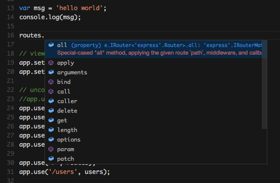
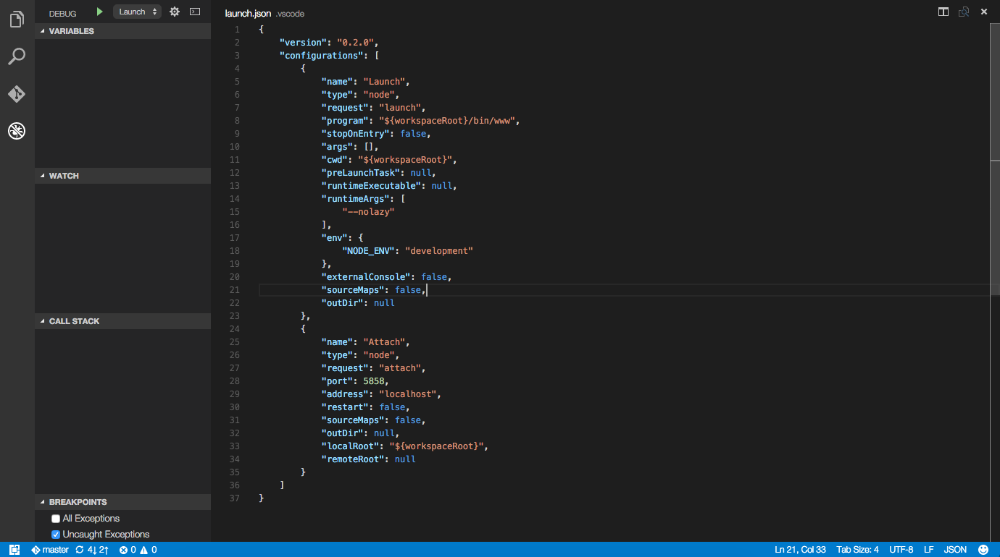

# Node.js Applications with VS Code

# 用VS Code开发Node.js应用

[Node.js](https://nodejs.org/) is a platform for building fast and scalable server applications using JavaScript. Node.js is the runtime and [NPM](https://www.npmjs.com/) is the Package Manager for Node.js modules.

[Node.js](https://nodejs.org/)是一个使用JavaScript开发和部署快速且规模化的服务端应用的平台。Node.js是运行时，而[NPM](https://www.npmjs.com/) 是Node.js模块的包管理器。

To get started, [install Node.js for your platform](https://nodejs.org/en/download/). The Node Package Manager is included in the Node.js distribution. You'll need to open a new terminal (command prompt) for `npm` to be on your PATH.

开始之前，你需要先[安装一个适合你的操作系统的Node.js](https://nodejs.org/en/download/)。Node包管理器（即npm）已经内置在了这个Node.js发行版中。你需要打开终端（控制台）设置`npm`的环境变量。

> **Tip!** You can download both the TypeScript and JavaScript versions of the sample application created in this walkthrough from the [vscode-samples](https://github.com/Microsoft/vscode-samples/archive/master.zip) repository.

> **Tip!** 你可以从[vscode-samples](https://github.com/Microsoft/vscode-samples/archive/master.zip) 这个仓库里下载JavaScript和TypeScript的示例程序。

## Express

[Express](http://expressjs.com/) is a very popular application framework for building and running Node.js applications. You can scaffold a new Express application using the Express Generator tool, which is typically installed globally on your computer.

[Express](http://expressjs.com/)是一个用于构建和运行Node.js应用的非常流行的框架。你可以用Express Generator Tool去创建一个新的Node.js应用，这个脚手架通常全局安装在你的计算机上。

```bash
npm install -g express-generator
```

We can now scaffold a new Express application called `myExpressApp`.

我们可以创建一个新的名为`myExpressApp`的Express应用

```bash
express myExpressApp
```

This creates a new folder called `myExpressApp` with the contents of your application.  To install all of the application's dependencies, go to the new folder and execute `npm install`:

这条命令将创建一个新的叫做`myExpressApp`的目录，里面是你的应用。为了安装这个应用所有的依赖项，你需要进入这个新创建的目录然后运行：`npm install`

```bash
cd myExpressApp
npm install
```

At this point, we should test that our application runs. The generated Express application has a `package.json` file which includes a `start` script to run `node ./bin/www`.  This will start the Node.js application running.

这时候，你应该测试一下你的应用能否跑起来。Express应用都有一个`package.json`文件，里面包含了`start`脚本，用来运行`node ./bin/www`。这将让你的Node.js应用跑起来。

From a terminal in the Express application folder, run:

在这个Express应用的目录里打开一个终端，运行：

```bash
npm start
```

The Node.js web server will start and you can browse to `http://localhost:3000` to see the running application.

Node.js Web服务器将会开启，你可以通过访问`http://localhost:3000`看到这个跑起来的应用。


## Great Code Editing Experiences

## 极好的代码编辑体验

Close the browser and from a terminal in the `myExpressApp` folder, stop the Node.js server by pressing `kbstyle(CTRL+C)`.

关掉你的浏览器，在`myExpressApp`目录的终端里用`kbstyle(CTRL+C)`停止Node.js服务器。

Now launch VS Code:

现在打开VS Code:

```bash
code .
```

>**Tip:** You can open files or folders directly from the command line.  The period '.' refers to the current folder, therefore VS Code will start and open the `myExpressApp` folder.

>**Tip:** 你可以直接通过命令行打开文件或者目录。这时候，'.'指向整个当前目录，因此VS Code将会运行，并且打开''myExpressApp'目录。

The [Node.js](https://nodejs.org/api/) and [Express](http://expressjs.com/api.html) documentation does a great job explaining how to build rich applications using the platform and framework. Visual Studio Code will make you more productive developing these types of applications by providing great code editing and navigation experiences.

[Node.js](https://nodejs.org/api/) 和 [Express](http://expressjs.com/api.html)的文档非常清晰的阐述了如何用这两者去构建富应用。而Visual Studio Code会通过提供极好的编辑体验和提示体验，来帮助你提高对这些富应用的生产力。

VS Code uses the TypeScript compiler to drive its JavaScript language service, which means we can take advantage of what the compiler can infer about your code. For example, let's create a simple string variable in `app.js` and send the contents of the string to the console.

VS Code使用TypeScript编译器去驱动其JavaScript语言服务，这意味着我们可以利用TypeScript编译器的能力去分析、推断你的代码。举个栗子，我们可以创建一个简单的字符串变量，然后将这个字符串在控制台中打印出来。

```javascript
var msg = 'hello world';
console.log(msg);
```

Note that when you typed `console.` IntelliSense on the `console` object was automatically presented to you. When editing JavaScript files, VS Code will automatically provide you with IntelliSense for the DOM.

注意，当你打出了`console.`的时候，`console`对象的智能提示就自动的出现在你眼前了。在编辑JavaScript程序的时候，VS Code将自动为你提供DOM的智能提示。


Also notice that VS Code knows that `msg` is a string based on the initialization to `'hello world'`.  Type `msg.` to bring up IntelliSense and you'll see all of the string functions available on `msg`.

另外你可以注意到，VS Code知道`msg`是一个字符串，因为你之前用`'hello world'`来初始化了它。输入`msg.`可以呼出智能提示，你会看到`msg`的所有可用的字符串方法。


## Adding a jsconfig.json Configuration File

## 添加 jsconfig.json 配置文件

You can give even more hints to Visual Studio Code through a configuration file for the workspace (the root folder). Add a new file and name it `jsconfig.json` with the following contents:

你可以利用工作空间（项目的根目录）中的配置文件来为VS Code添加更多的提示。创建一个名叫`jsconfig.json`的新文件，内容如下：

```json
{
    "compilerOptions": {
        "target": "es5",
        "module": "commonjs"
    }
}
```

The presence of this file lets VS Code know that it should treat all the files under this root as part of the same project.  The specific `compilerOptions` tells VS Code you are writing ES5 compliant code and you want to use the **CommonJS** [module system](http://www.commonjs.org/specs/modules/1.0).

这个配置文件可以让VS Code把根目录下的所有文件当做同一个项目的一部分来对待。`compilerOptions`字段告诉了VS Code：你在编写兼容ES5规范的代码，并且使用**CommonJS**[模块系统](http://www.commonjs.org/specs/modules/1.0).

## Typings

VS Code can use TypeScript definition files (for example [`node.d.ts`](https://github.com/DefinitelyTyped/DefinitelyTyped/blob/master/node/node.d.ts)) to provide metadata to VS Code about the JavaScript based frameworks you are consuming in your application. Because TypeScript definition files are written in TypeScript, they can express the data types of parameters and functions, allowing VS Code to provide not only a rich IntelliSense experience, but also warnings when an API is being used incorrectly.

VS Code能够使用TypeScript定义文件（例如[`node.d.ts`](https://github.com/DefinitelyTyped/DefinitelyTyped/blob/master/node/node.d.ts)），为VS Code提供你的应用所使用的框架的元数据。由于TypeScript定义文件是用TypeScript编写的，所以它们可以分辨参数数据的类型和函数的类型，这允许了VS Code不仅提供智能提示功能，还可以在你错误的使用了API的时候发出警告。

[Typings](https://github.com/typings/typings), the type definition manager for TypeScript, makes it easy to search for and install TypeScript definition files into your workspace. This tool can download the requested definitions from a variety of sources, including the [DefinitelyTyped repository](https://github.com/DefinitelyTyped/DefinitelyTyped). As we did with the express generator, we will install Typings globally using NPM so that you can use the tool in any application you create.

[Typings](https://github.com/typings/typings)是TypeScript的类型定义管理器，它可以让我们更容易地搜索和在工作空间中安装TypeScript定义文件。这个工具可以从一个海量源中下载定义文件，包括[DefinitelyTyped repository](https://github.com/DefinitelyTyped/DefinitelyTyped)。就像我们之前安装Express生成器一样，我们将用NPM全局安装Typings，这样你就可以在你的任何应用中使用这个工具。

```bash
npm install -g typings
```

>**Tip:** Typings has a number of options for configuring where and how definition files are downloaded, from the terminal run `typings --help` for more information.

>**Tip:** Typings有许多的配置选项，用于配置定义文件在哪里、通过何种方式下载。在终端中运行：`typings --help`可以看到更多信息。

Go back to the file `app.js` and notice that if you hover over the Node.js global object `__dirname`, VS Code does not know the type and displays `any`.

回到`app.js`这个文件，你会注意到，当鼠标悬浮在Node.js的全局对象`__dirname`上的时候，VS Code并不知道它的类型，并且显示`any`。

Now, using the Typings command line, pull down the Node and Express definition files.

现在，使用Typings的命令行，拉取Node和Express的定义文件。

```bash
typings install node --ambient
typings install express serve-static express-serve-static-core --ambient
```

>**Tip:** You can download multiple definition files by combining them on the command line, as you can see from the Express typings above.  We need to install the typings for Express and also it's references.

>**Tip:** 你可以在一行命令中安装多个类型定义文件，就像上面我们做的那样。我们不仅需要为Express安装类型定义文件，还要为它的引用安装。

Notice how VS Code now understands what `__dirname` is, based on the metadata from the `node.d.ts` file. Even more exciting, you can get full IntelliSense against the Node.js framework. For example, you can require `http` and get full IntelliSense against the `http` class as you type in Visual Studio Code.

你会发现利用`node.s.ts`文件，VS Code现在已经明白了`__dirname`是什么类型的。更让人激动的是，你可以在使用Node.js框架的情况下获得完整的智能提示了，当你`require`一个`http`模块的时候，你刚在VS Code里输入，一个完整的智能提示就会出现在`http`旁边。


You can also write code that references modules in other files. For example, in `app.js` we require the `./routes/index` module, which exports an `Express.Router` class. If you bring up IntelliSense on `routes`, you can see the shape of the `Router` class.

你也可以编写代码，引用在其他文件中的模块试试。举个栗子，在`app.js`中，我们require了`./routes/index`模块，这个模块输出了一个`Express.Router`的类。如果你在`routes`上呼出智能提示，你就会看到`Router`类的大致结构。



## Debugging your Node Application

## 为你的Node应用Debug

In order to run and debug your Node.js application from within VS Code, you need to configure how the application will be started. To do this, click on the Debug icon in the View Bar on the left of Visual Studio Code.

为了在VS Code中运行和调试你的Node.js应用，你需要设置应该以何种方式被启动。在VS Code左侧的View这一栏中点击Debug图标。


Click on the Configure gear icon at the top of the Debug view to create a default `launch.json` file and select "Node.js" as the Debug Environment. This configuration file lets you specify how to start the application, what arguments to pass in, the working directory, and more. When the file is first created, VS Code will look in `package.json` for a `start` script and will use that value as the `program` (which in this case is `${workspaceRoot}/bin/www`) for the `Launch` configuration. A second `Attach` configuration is also created to show you how to attach to a running Node application.

在Debug视图上点击齿轮形的图标，创建一个默认的`launch.json`文件，选择“Node.js”作为调试环境。这个配置文件让你能够设置如何去启动应用、启动的参数、工作目录等等。当文件第一次被创建的时候VS Code会在`package.json`中寻找`start`脚本，并且会把`start`的值当做`Launch`配置文件的`program`（当前情况下是`${workspaceRoot}/bin/www`）。第二个名为`Attach`的配置文件也会被创建，用于配置连接到运行的Node应用的方式。



Take the defaults for everything else. If you do not have [Auto Save](/md/编辑器/基础.md#saveauto-save) on, save the file by pressing `kb(workbench.action.files.save)`, and make sure `Launch` is selected in the configuration dropdown at the top of the Debug view. Open `app.js` and set a breakpoint on the line of code we wrote earlier `var msg = 'hello world';` by clicking in the gutter to the left of the line number. Press `kb(workbench.action.debug.start)` to start debugging the application. VS Code will start the server in a new terminal and hit the breakpoint we set. From there you can inspect variables, create watches, and step through your code.

对于其余的选项，使用默认配置即可。如果你没有开启 [自动保存](/md/编辑器/基础.md#saveauto-save) ，通过输入`kb(workbench.action.files.save)`来保存文件，并且确保Debug视图中的下拉菜单里的`Launch`被正确的选择了。打开`app.js`在`var msg = 'hello world';`的行号处设置一个断点。 输入`kb(workbench.action.debug.start)`，开始调试应用。VS Code将会在一个新的终端里开启服务器并在我们设置的断点处暂停。这里你可以审查变量、创建watcher，以及分部调试代码。


## Extensions

## 扩展

The community is continually developing more and more valuable extensions for Node.js. Here are some popular extensions that you might find useful.

VS Code的社区正在为Node.js不断开发越来越多的有价值的扩展。
这里有一些你可能会觉得有用的，同时也很流行的扩展。

* [View Node Package](https://marketplace.visualstudio.com/items?itemName=dkundel.vscode-npm-source) - Open a Node.js package repository/documentation straight from VS Code.（直接用VS Code打开Node.js包的仓库/文档）
* [JavaScript (ES6) code snippets](https://marketplace.visualstudio.com/items?itemName=xabikos.JavaScriptSnippets) - Snippets for JavaScript in ES6 syntax.（支持ES6语法的JavaScript代码高亮插件）
* [ESLint](https://marketplace.visualstudio.com/items?itemName=dbaeumer.vscode-eslint) - Integrates ESLint into VS Code.（在VS Code中集成了ESLint）
* [JSHint](https://marketplace.visualstudio.com/items?itemName=dbaeumer.jshint) - Integrates JSHint into VS Code.（在VS Code中集成了ESHint）
* [Add JSDoc comments](https://marketplace.visualstudio.com/items?itemName=stevencl.addDocComments) - Adds **JSDoc** @param and @return tags for selected function signatures in JS and TS.（用于添加包含@param和@return的注释）
* [Prettify JSON](https://marketplace.visualstudio.com/items?itemName=mohsen1.prettify-json) - Prettify ugly JSON inside VS Code.（在VS Code里实现JSON的格式化和压缩）
* [Beautify](https://marketplace.visualstudio.com/items?itemName=HookyQR.beautify) - This extension enables running [js-beautify](http://jsbeautifier.org/) in VS Code.（这个插件允许在VS Code中运行 [js-beautify](http://jsbeautifier.org/)）

## Next Steps

## 下一步

There is much more to explore with Visual Studio Code, please try the following topics:

Visual Studio Code还有很多地方可以去探索，可以看看下面的几个话题：

* [Debugging](/md/编辑器/调试.md) - This is where VS Code really shines
* [Editing Evolved](/md/编辑器/与时俱进的编辑体验.md) - Lint, IntelliSense, Lightbulbs, Peek and Goto Definition and more 
* [ASP.NET Core](/md/运行时/ASPnet5.md) - End to end sample showing off our ASP.NET Core and .NET Core support with a sample app
* [Tasks](/md/编辑器/任务.md) - Running tasks with Gulp, Grunt and Jake.  Showing Errors and Warnings


